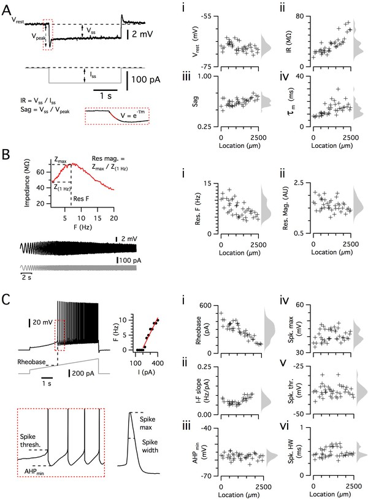
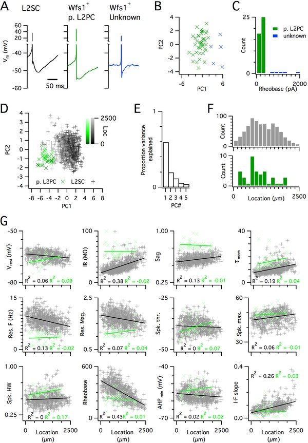
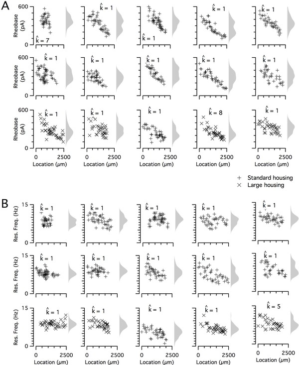
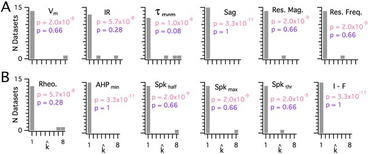
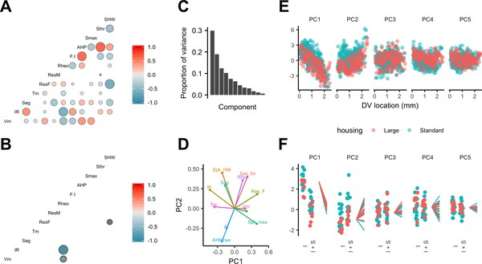
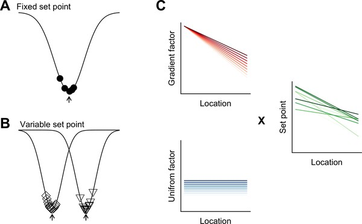

```{r setup, include=FALSE}
knitr::opts_chunk$set(echo = TRUE)
```


---
authors:
  - type: Person
    affiliations:
      - type: Organization
        address:
          type: PostalAddress
          addressCountry: United Kingdom
          addressLocality: Edinburgh
        name: 'Centre for Discovery Brain Sciences, University of Edinburgh'
    familyNames:
      - Pastoll
    givenNames:
      - Hugh
  - type: Person
    affiliations:
      - type: Organization
        address:
          type: PostalAddress
          addressCountry: United Kingdom
          addressLocality: Edinburgh
        name: 'Centre for Discovery Brain Sciences, University of Edinburgh'
    familyNames:
      - Garden
    givenNames:
      - Derek
      - L
  - type: Person
    affiliations:
      - type: Organization
        address:
          type: PostalAddress
          addressCountry: United States
          addressLocality: London
        name: The Alan Turing Institute
      - type: Organization
        address:
          type: PostalAddress
          addressCountry: United Kingdom
          addressLocality: Edinburgh
        name: >-
          School of Mathematics, Maxwell Institute and Centre for Statistics,
          University of Edinburgh
    familyNames:
      - Papastathopoulos
    givenNames:
      - Ioannis
  - type: Person
    affiliations:
      - type: Organization
        address:
          type: PostalAddress
          addressCountry: United Kingdom
          addressLocality: Edinburgh
        name: 'Centre for Discovery Brain Sciences, University of Edinburgh'
    familyNames:
      - Sürmeli
    givenNames:
      - Gülşen
  - type: Person
    affiliations:
      - type: Organization
        address:
          type: PostalAddress
          addressCountry: United Kingdom
          addressLocality: Edinburgh
        name: 'Centre for Discovery Brain Sciences, University of Edinburgh'
    emails:
      - mattnolan@ed.ac.uk
    familyNames:
      - Nolan
    givenNames:
      - Matthew
      - F
dateAccepted:
  type: Date
  value: '2020-02-04'
datePublished:
  type: Date
  value: '2020-02-13'
dateReceived:
  type: Date
  value: '2019-09-26'
description:
  - type: Paragraph
    content:
      - >-
        Distinctions between cell types underpin organizational principles for
        nervous system function. Functional variation also exists between
        neurons of the same type. This is exemplified by correspondence between
        grid cell spatial scales and the synaptic integrative properties of
        stellate cells (SCs) in the medial entorhinal cortex. However, we know
        little about how functional variability is structured either within or
        between individuals. Using ex-vivo patch-clamp recordings from up to 55
        SCs per mouse, we found that integrative properties vary between mice
        and, in contrast to the modularity of grid cell spatial scales, have a
        continuous dorsoventral organization. Our results constrain mechanisms
        for modular grid firing and provide evidence for inter-animal phenotypic
        variability among neurons of the same type. We suggest that neuron type
        properties are tuned to circuit-level set points that vary within and
        between animals.
editors:
  - type: Person
    affiliations:
      - type: Organization
        address:
          type: PostalAddress
          addressCountry: United States
        name: Stanford School of Medicine
    familyNames:
      - Giocomo
    givenNames:
      - Lisa
fundedBy:
  - type: MonetaryGrant
    funders:
      - type: Organization
        name: Biotechnology and Biological Sciences Research Council (BBSRC)
    identifiers:
      - type: PropertyValue
        value: 200855/Z/16/Z
  - type: MonetaryGrant
    funders:
      - type: Organization
        name: Biotechnology and Biological Sciences Research Council (BBSRC)
    identifiers:
      - type: PropertyValue
        value: BB/1022147/1
  - type: MonetaryGrant
    funders:
      - type: Organization
        name: Biotechnology and Biological Sciences Research Council
    identifiers:
      - type: PropertyValue
        value: BB/H020284/1
  - type: MonetaryGrant
    funders:
      - type: Organization
        name: Wellcome
    identifiers:
      - type: PropertyValue
        value: 200855/Z/16/Z
identifiers:
  - type: PropertyValue
    name: publisher-id
    propertyID: 'https://registry.identifiers.org/registry/publisher-id'
    value: '52258'
  - type: PropertyValue
    name: doi
    propertyID: 'https://registry.identifiers.org/registry/doi'
    value: 10.7554/eLife.52258
  - type: PropertyValue
    name: elocation-id
    propertyID: 'https://registry.identifiers.org/registry/elocation-id'
    value: e52258
isPartOf:
  type: PublicationVolume
  isPartOf:
    type: Periodical
    identifiers:
      - type: PropertyValue
        name: nlm-ta
        propertyID: 'https://registry.identifiers.org/registry/nlm-ta'
        value: elife
      - type: PropertyValue
        name: publisher-id
        propertyID: 'https://registry.identifiers.org/registry/publisher-id'
        value: eLife
    issns:
      - 2050-084X
    publisher:
      type: Organization
      name: 'eLife Sciences Publications, Ltd'
    title: eLife
  volumeNumber: '9'
keywords:
  - entorhinal cortex
  - synaptic integration
  - presynaptic function
  - multi-vesicular release
  - synaptic vesicle
  - Mouse
licenses:
  - type: CreativeWork
    url: 'http://creativecommons.org/licenses/by/4.0/'
    content:
      - type: Paragraph
        content:
          - 'This article is distributed under the terms of the '
          - type: Link
            target: 'http://creativecommons.org/licenses/by/4.0/'
            content:
              - Creative Commons Attribution License
          - >-
            , which permits unrestricted use and redistribution provided that
            the original author and source are credited.
references:
  - type: Article
    id: bib1
    authors:
      - type: Person
        familyNames:
          - Adamson
        givenNames:
          - CL
      - type: Person
        familyNames:
          - Reid
        givenNames:
          - MA
      - type: Person
        familyNames:
          - Mo
        givenNames:
          - ZL
      - type: Person
        familyNames:
          - Bowne-English
        givenNames:
          - J
      - type: Person
        familyNames:
          - Davis
        givenNames:
          - RL
    datePublished: '2002'
    isPartOf:
      type: PublicationVolume
      isPartOf:
        type: Periodical
        name: The Journal of Comparative Neurology
      volumeNumber: 447
    pageEnd: 350
    pageStart: 331
    title: >-
      Firing features and potassium channel content of murine spiral ganglion
      neurons vary with cochlear location
  - type: Article
    id: bib2
    authors:
      - type: Person
        familyNames:
          - Alonso
        givenNames:
          - A
      - type: Person
        familyNames:
          - Klink
        givenNames:
          - R
    datePublished: '1993'
    isPartOf:
      type: PublicationVolume
      isPartOf:
        type: Periodical
        name: Journal of Neurophysiology
      volumeNumber: 70
    pageEnd: 143
    pageStart: 128
    title: >-
      Differential electroresponsiveness of stellate and pyramidal-like cells of
      medial entorhinal cortex layer II
  - type: Article
    id: bib3
    authors:
      - type: Person
        familyNames:
          - Angelo
        givenNames:
          - K
      - type: Person
        familyNames:
          - Rancz
        givenNames:
          - EA
      - type: Person
        familyNames:
          - Pimentel
        givenNames:
          - D
      - type: Person
        familyNames:
          - Hundahl
        givenNames:
          - C
      - type: Person
        familyNames:
          - Hannibal
        givenNames:
          - J
      - type: Person
        familyNames:
          - Fleischmann
        givenNames:
          - A
      - type: Person
        familyNames:
          - Pichler
        givenNames:
          - B
      - type: Person
        familyNames:
          - Margrie
        givenNames:
          - TW
    datePublished: '2012'
    isPartOf:
      type: PublicationVolume
      isPartOf:
        type: Periodical
        name: Nature
      volumeNumber: 488
    pageEnd: 378
    pageStart: 375
    title: >-
      A biophysical signature of network affiliation and sensory processing in
      mitral cells
  - type: Article
    id: bib4
    authors:
      - type: Person
        familyNames:
          - Baayen
        givenNames:
          - RH
      - type: Person
        familyNames:
          - Davidson
        givenNames:
          - DJ
      - type: Person
        familyNames:
          - Bates
        givenNames:
          - DM
    datePublished: '2008'
    isPartOf:
      type: PublicationVolume
      isPartOf:
        type: Periodical
        name: Journal of Memory and Language
      volumeNumber: 59
    pageEnd: 412
    pageStart: 390
    title: Mixed-effects modeling with crossed random effects for subjects and items
  - type: Article
    id: bib5
    authors:
      - type: Person
        familyNames:
          - Barr
        givenNames:
          - DJ
      - type: Person
        familyNames:
          - Levy
        givenNames:
          - R
      - type: Person
        familyNames:
          - Scheepers
        givenNames:
          - C
      - type: Person
        familyNames:
          - Tily
        givenNames:
          - HJ
    datePublished: '2013'
    isPartOf:
      type: PublicationVolume
      isPartOf:
        type: Periodical
        name: Journal of Memory and Language
      volumeNumber: 68
    pageEnd: 278
    pageStart: 255
    title: >-
      Random effects structure for confirmatory hypothesis testing: keep it
      maximal
  - type: Article
    id: bib6
    authors:
      - type: Person
        familyNames:
          - Barry
        givenNames:
          - C
      - type: Person
        familyNames:
          - Hayman
        givenNames:
          - R
      - type: Person
        familyNames:
          - Burgess
        givenNames:
          - 'N'
      - type: Person
        familyNames:
          - Jeffery
        givenNames:
          - KJ
    datePublished: '2007'
    isPartOf:
      type: PublicationVolume
      isPartOf:
        type: Periodical
        name: Nature Neuroscience
      volumeNumber: 10
    pageEnd: 684
    pageStart: 682
    title: Experience-dependent rescaling of entorhinal grids
  - type: Article
    id: bib7
    authors:
      - type: Person
        familyNames:
          - Bartoń
        givenNames:
          - K
    datePublished: '2014'
  - type: Article
    id: bib8
    authors:
      - type: Person
        familyNames:
          - Bates
        givenNames:
          - D
      - type: Person
        familyNames:
          - Mächler
        givenNames:
          - M
      - type: Person
        familyNames:
          - Bolker
        givenNames:
          - B
      - type: Person
        familyNames:
          - Walker
        givenNames:
          - S
    datePublished: '2014'
    isPartOf:
      type: Periodical
      name: arXiv
    title: Fitting linear Mixed-Effects models using lme4
  - type: Article
    id: bib9
    authors:
      - type: Person
        familyNames:
          - Benjamini
        givenNames:
          - 'Y'
      - type: Person
        familyNames:
          - Hochberg
        givenNames:
          - 'Y'
    datePublished: '1995'
    isPartOf:
      type: PublicationVolume
      isPartOf:
        type: Periodical
        name: 'Journal of the Royal Statistical Society: Series B'
      volumeNumber: 57
    pageEnd: 300
    pageStart: 289
    title: >-
      Controlling the false discovery rate: a practical and powerful approach to
      multiple testing
  - type: Article
    id: bib10
    authors:
      - type: Person
        familyNames:
          - Boehlen
        givenNames:
          - A
      - type: Person
        familyNames:
          - Heinemann
        givenNames:
          - U
      - type: Person
        familyNames:
          - Erchova
        givenNames:
          - I
    datePublished: '2010'
    isPartOf:
      type: PublicationVolume
      isPartOf:
        type: Periodical
        name: Journal of Neuroscience
      volumeNumber: 30
    pageEnd: 4589
    pageStart: 4585
    title: >-
      The range of intrinsic frequencies represented by medial entorhinal cortex
      stellate cells extends with age
  - type: Article
    id: bib11
    authors:
      - type: Person
        familyNames:
          - Booth
        givenNames:
          - CA
      - type: Person
        familyNames:
          - Ridler
        givenNames:
          - T
      - type: Person
        familyNames:
          - Murray
        givenNames:
          - TK
      - type: Person
        familyNames:
          - Ward
        givenNames:
          - MA
      - type: Person
        familyNames:
          - de
          - Groot
        givenNames:
          - E
      - type: Person
        familyNames:
          - Goodfellow
        givenNames:
          - M
      - type: Person
        familyNames:
          - Phillips
        givenNames:
          - KG
      - type: Person
        familyNames:
          - Randall
        givenNames:
          - AD
      - type: Person
        familyNames:
          - Brown
        givenNames:
          - JT
    datePublished: '2016'
    isPartOf:
      type: PublicationVolume
      isPartOf:
        type: Periodical
        name: Journal of Neuroscience
      volumeNumber: 36
    pageEnd: 324
    pageStart: 312
    title: >-
      Electrical and network neuronal properties are preferentially disrupted in
      Dorsal, but not ventral, medial entorhinal cortex in a mouse model of
      tauopathy
  - type: Article
    id: bib12
    authors:
      - type: Person
        familyNames:
          - Brun
        givenNames:
          - VH
      - type: Person
        familyNames:
          - Solstad
        givenNames:
          - T
      - type: Person
        familyNames:
          - Kjelstrup
        givenNames:
          - KB
      - type: Person
        familyNames:
          - Fyhn
        givenNames:
          - M
      - type: Person
        familyNames:
          - Witter
        givenNames:
          - MP
      - type: Person
        familyNames:
          - Moser
        givenNames:
          - EI
      - type: Person
        familyNames:
          - Moser
        givenNames:
          - MB
    datePublished: '2008'
    isPartOf:
      type: PublicationVolume
      isPartOf:
        type: Periodical
        name: Hippocampus
      volumeNumber: 18
    pageEnd: 1212
    pageStart: 1200
    title: >-
      Progressive increase in grid scale from dorsal to ventral medial
      entorhinal cortex
  - type: Article
    id: bib13
    authors:
      - type: Person
        familyNames:
          - Burak
        givenNames:
          - 'Y'
      - type: Person
        familyNames:
          - Fiete
        givenNames:
          - IR
    datePublished: '2009'
    isPartOf:
      type: PublicationVolume
      isPartOf:
        type: Periodical
        name: PLOS Computational Biology
      volumeNumber: 5
    title: >-
      Accurate path integration in continuous attractor network models of grid
      cells
  - type: Article
    id: bib14
    authors:
      - type: Person
        familyNames:
          - Burgess
        givenNames:
          - 'N'
      - type: Person
        familyNames:
          - Barry
        givenNames:
          - C
      - type: Person
        familyNames:
          - O'Keefe
        givenNames:
          - J
    datePublished: '2007'
    isPartOf:
      type: PublicationVolume
      isPartOf:
        type: Periodical
        name: Hippocampus
      volumeNumber: 17
    pageEnd: 812
    pageStart: 801
    title: An oscillatory interference model of grid cell firing
  - type: Article
    id: bib15
    authors:
      - type: Person
        familyNames:
          - Burgess
        givenNames:
          - 'N'
    datePublished: '2008'
    isPartOf:
      type: PublicationVolume
      isPartOf:
        type: Periodical
        name: Hippocampus
      volumeNumber: 18
    pageEnd: 1174
    pageStart: 1157
    title: 'Grid cells and theta as oscillatory interference: theory and predictions'
  - type: Article
    id: bib16
    authors:
      - type: Person
        familyNames:
          - Burton
        givenNames:
          - BG
      - type: Person
        familyNames:
          - Economo
        givenNames:
          - MN
      - type: Person
        familyNames:
          - Lee
        givenNames:
          - GJ
      - type: Person
        familyNames:
          - White
        givenNames:
          - JA
    datePublished: '2008'
    isPartOf:
      type: PublicationVolume
      isPartOf:
        type: Periodical
        name: Journal of Neurophysiology
      volumeNumber: 100
    pageEnd: 3157
    pageStart: 3144
    title: >-
      Development of theta rhythmicity in entorhinal stellate cells of the
      juvenile rat
  - type: Article
    id: bib17
    authors:
      - type: Person
        familyNames:
          - Bush
        givenNames:
          - D
      - type: Person
        familyNames:
          - Burgess
        givenNames:
          - 'N'
    datePublished: '2014'
    isPartOf:
      type: PublicationVolume
      isPartOf:
        type: Periodical
        name: The Journal of Neuroscience
      volumeNumber: 34
    pageEnd: 5079
    pageStart: 5065
    title: >-
      A hybrid oscillatory interference/continuous attractor network model of
      grid cell firing
  - type: Article
    id: bib18
    authors:
      - type: Person
        familyNames:
          - Canto
        givenNames:
          - CB
      - type: Person
        familyNames:
          - Witter
        givenNames:
          - MP
    datePublished: '2012'
    isPartOf:
      type: PublicationVolume
      isPartOf:
        type: Periodical
        name: Hippocampus
      volumeNumber: 22
    pageEnd: 1299
    pageStart: 1277
    title: "Cellular properties of principal neurons in the rat entorhinal cortex II\_the medial entorhinal cortex"
  - type: Article
    id: bib19
    authors:
      - type: Person
        familyNames:
          - Cembrowski
        givenNames:
          - MS
      - type: Person
        familyNames:
          - Menon
        givenNames:
          - V
    datePublished: '2018'
    isPartOf:
      type: PublicationVolume
      isPartOf:
        type: Periodical
        name: Trends in Neurosciences
      volumeNumber: 41
    pageEnd: 348
    pageStart: 337
    title: Continuous variation within cell types of the nervous system
  - type: Article
    id: bib20
    authors:
      - type: Person
        familyNames:
          - Diehl
        givenNames:
          - GW
      - type: Person
        familyNames:
          - Hon
        givenNames:
          - OJ
      - type: Person
        familyNames:
          - Leutgeb
        givenNames:
          - S
      - type: Person
        familyNames:
          - Leutgeb
        givenNames:
          - JK
    datePublished: '2017'
    isPartOf:
      type: PublicationVolume
      isPartOf:
        type: Periodical
        name: Neuron
      volumeNumber: 94
    pageEnd: 92
    pageStart: 83
    title: >-
      Grid and nongrid cells in medial entorhinal cortex represent spatial
      location and environmental features with complementary coding schemes
  - type: Article
    id: bib21
    authors:
      - type: Person
        familyNames:
          - Dodson
        givenNames:
          - PD
      - type: Person
        familyNames:
          - Pastoll
        givenNames:
          - H
      - type: Person
        familyNames:
          - Nolan
        givenNames:
          - MF
    datePublished: '2011'
    isPartOf:
      type: PublicationVolume
      isPartOf:
        type: Periodical
        name: The Journal of Physiology
      volumeNumber: 589
    pageEnd: 3008
    pageStart: 2993
    title: >-
      Dorsal-ventral organization of theta-like activity intrinsic to entorhinal
      stellate neurons is mediated by differences in stochastic current
      fluctuations
  - type: Article
    id: bib22
    authors:
      - type: Person
        familyNames:
          - Domnisoru
        givenNames:
          - C
      - type: Person
        familyNames:
          - Kinkhabwala
        givenNames:
          - AA
      - type: Person
        familyNames:
          - Tank
        givenNames:
          - DW
    datePublished: '2013'
    isPartOf:
      type: PublicationVolume
      isPartOf:
        type: Periodical
        name: Nature
      volumeNumber: 495
    pageEnd: 204
    pageStart: 199
    title: Membrane potential dynamics of grid cells
  - type: Article
    id: bib23
    authors:
      - type: Person
        familyNames:
          - Donato
        givenNames:
          - F
      - type: Person
        familyNames:
          - Jacobsen
        givenNames:
          - RI
      - type: Person
        familyNames:
          - Moser
        givenNames:
          - MB
      - type: Person
        familyNames:
          - Moser
        givenNames:
          - EI
    datePublished: '2017'
    isPartOf:
      type: PublicationVolume
      isPartOf:
        type: Periodical
        name: Science
      volumeNumber: 355
    title: Stellate cells drive maturation of the entorhinal-hippocampal circuit
  - type: Article
    id: bib24
    authors:
      - type: Person
        familyNames:
          - Fletcher
        givenNames:
          - LN
      - type: Person
        familyNames:
          - Williams
        givenNames:
          - SR
    datePublished: '2019'
    isPartOf:
      type: PublicationVolume
      isPartOf:
        type: Periodical
        name: Neuron
      volumeNumber: 101
    pageEnd: 90
    pageStart: 76
    title: >-
      Neocortical topology governs the dendritic integrative capacity of layer 5
      pyramidal neurons
  - type: Article
    id: bib25
    authors:
      - type: Person
        familyNames:
          - Fox
        givenNames:
          - J
      - type: Person
        familyNames:
          - Weisberg
        givenNames:
          - S
    datePublished: '2018'
    isPartOf:
      type: Periodical
      name: An R Companion to Applied Regression
  - type: Article
    id: bib26
    authors:
      - type: Person
        familyNames:
          - Fuhs
        givenNames:
          - MC
      - type: Person
        familyNames:
          - Touretzky
        givenNames:
          - DS
    datePublished: '2006'
    isPartOf:
      type: PublicationVolume
      isPartOf:
        type: Periodical
        name: Journal of Neuroscience
      volumeNumber: 26
    pageEnd: 4276
    pageStart: 4266
    title: A spin glass model of path integration in rat medial entorhinal cortex
  - type: Article
    id: bib27
    authors:
      - type: Person
        familyNames:
          - Fyhn
        givenNames:
          - M
      - type: Person
        familyNames:
          - Molden
        givenNames:
          - S
      - type: Person
        familyNames:
          - Witter
        givenNames:
          - MP
      - type: Person
        familyNames:
          - Moser
        givenNames:
          - EI
      - type: Person
        familyNames:
          - Moser
        givenNames:
          - MB
    datePublished: '2004'
    isPartOf:
      type: PublicationVolume
      isPartOf:
        type: Periodical
        name: Science
      volumeNumber: 305
    pageEnd: 1264
    pageStart: 1258
    title: Spatial representation in the entorhinal cortex
  - type: Article
    id: bib28
    authors:
      - type: Person
        familyNames:
          - Garden
        givenNames:
          - DL
      - type: Person
        familyNames:
          - Dodson
        givenNames:
          - PD
      - type: Person
        familyNames:
          - O'Donnell
        givenNames:
          - C
      - type: Person
        familyNames:
          - White
        givenNames:
          - MD
      - type: Person
        familyNames:
          - Nolan
        givenNames:
          - MF
    datePublished: '2008'
    isPartOf:
      type: PublicationVolume
      isPartOf:
        type: Periodical
        name: Neuron
      volumeNumber: 60
    pageEnd: 889
    pageStart: 875
    title: >-
      Tuning of synaptic integration in the medial entorhinal cortex to the
      organization of grid cell firing fields
  - type: Article
    id: bib29
    authors:
      - type: Person
        familyNames:
          - Geiler-Samerotte
        givenNames:
          - KA
      - type: Person
        familyNames:
          - Bauer
        givenNames:
          - CR
      - type: Person
        familyNames:
          - Li
        givenNames:
          - S
      - type: Person
        familyNames:
          - Ziv
        givenNames:
          - 'N'
      - type: Person
        familyNames:
          - Gresham
        givenNames:
          - D
      - type: Person
        familyNames:
          - Siegal
        givenNames:
          - ML
    datePublished: '2013'
    isPartOf:
      type: PublicationVolume
      isPartOf:
        type: Periodical
        name: Current Opinion in Biotechnology
      volumeNumber: 24
    pageEnd: 759
    pageStart: 752
    title: >-
      The details in the distributions: why and how to study phenotypic
      variability
  - type: Article
    id: bib30
    authors:
      - type: Person
        familyNames:
          - Giocomo
        givenNames:
          - LM
      - type: Person
        familyNames:
          - Zilli
        givenNames:
          - EA
      - type: Person
        familyNames:
          - Fransén
        givenNames:
          - E
      - type: Person
        familyNames:
          - Hasselmo
        givenNames:
          - ME
    datePublished: '2007'
    isPartOf:
      type: PublicationVolume
      isPartOf:
        type: Periodical
        name: Science
      volumeNumber: 315
    pageEnd: 1722
    pageStart: 1719
    title: >-
      Temporal frequency of subthreshold oscillations scales with entorhinal
      grid cell field spacing
  - type: Article
    id: bib31
    authors:
      - type: Person
        familyNames:
          - Giocomo
        givenNames:
          - LM
      - type: Person
        familyNames:
          - Hussaini
        givenNames:
          - SA
      - type: Person
        familyNames:
          - Zheng
        givenNames:
          - F
      - type: Person
        familyNames:
          - Kandel
        givenNames:
          - ER
      - type: Person
        familyNames:
          - Moser
        givenNames:
          - MB
      - type: Person
        familyNames:
          - Moser
        givenNames:
          - EI
    datePublished: '2011'
    isPartOf:
      type: PublicationVolume
      isPartOf:
        type: Periodical
        name: Cell
      volumeNumber: 147
    pageEnd: 1170
    pageStart: 1159
    title: Grid cells use HCN1 channels for spatial scaling
  - type: Article
    id: bib32
    authors:
      - type: Person
        familyNames:
          - Giocomo
        givenNames:
          - LM
      - type: Person
        familyNames:
          - Stensola
        givenNames:
          - T
      - type: Person
        familyNames:
          - Bonnevie
        givenNames:
          - T
      - type: Person
        familyNames:
          - Van
          - Cauter
        givenNames:
          - T
      - type: Person
        familyNames:
          - Moser
        givenNames:
          - MB
      - type: Person
        familyNames:
          - Moser
        givenNames:
          - EI
    datePublished: '2014'
    isPartOf:
      type: PublicationVolume
      isPartOf:
        type: Periodical
        name: Current Biology
      volumeNumber: 24
    pageEnd: 262
    pageStart: 252
    title: Topography of head direction cells in medial entorhinal cortex
  - type: Article
    id: bib33
    authors:
      - type: Person
        familyNames:
          - Giocomo
        givenNames:
          - LM
      - type: Person
        familyNames:
          - Hasselmo
        givenNames:
          - ME
    datePublished: 2008a
    isPartOf:
      type: PublicationVolume
      isPartOf:
        type: Periodical
        name: Journal of Neuroscience
      volumeNumber: 28
    pageEnd: 9425
    pageStart: 9414
    title: >-
      Time constants of h current in layer ii stellate cells differ along the
      dorsal to ventral Axis of medial entorhinal cortex
  - type: Article
    id: bib34
    authors:
      - type: Person
        familyNames:
          - Giocomo
        givenNames:
          - LM
      - type: Person
        familyNames:
          - Hasselmo
        givenNames:
          - ME
    datePublished: 2008b
    isPartOf:
      type: PublicationVolume
      isPartOf:
        type: Periodical
        name: Hippocampus
      volumeNumber: 18
    pageEnd: 1199
    pageStart: 1186
    title: >-
      Computation by oscillations: implications of experimental data for
      theoretical models of grid cells
  - type: Article
    id: bib35
    authors:
      - type: Person
        familyNames:
          - Giocomo
        givenNames:
          - LM
      - type: Person
        familyNames:
          - Hasselmo
        givenNames:
          - ME
    datePublished: '2009'
    isPartOf:
      type: PublicationVolume
      isPartOf:
        type: Periodical
        name: Journal of Neuroscience
      volumeNumber: 29
    pageEnd: 7630
    pageStart: 7625
    title: >-
      Knock-out of HCN1 subunit flattens dorsal-ventral frequency gradient of
      medial entorhinal neurons in adult mice
  - type: Article
    id: bib36
    authors:
      - type: Person
        familyNames:
          - Goaillard
        givenNames:
          - JM
      - type: Person
        familyNames:
          - Taylor
        givenNames:
          - AL
      - type: Person
        familyNames:
          - Schulz
        givenNames:
          - DJ
      - type: Person
        familyNames:
          - Marder
        givenNames:
          - E
    datePublished: '2009'
    isPartOf:
      type: PublicationVolume
      isPartOf:
        type: Periodical
        name: Nature Neuroscience
      volumeNumber: 12
    pageEnd: 1430
    pageStart: 1424
    title: >-
      Functional consequences of animal-to-animal variation in circuit
      parameters
  - type: Article
    id: bib37
    authors:
      - type: Person
        familyNames:
          - Gonzalez-Sulser
        givenNames:
          - A
      - type: Person
        familyNames:
          - Parthier
        givenNames:
          - D
      - type: Person
        familyNames:
          - Candela
        givenNames:
          - A
      - type: Person
        familyNames:
          - McClure
        givenNames:
          - C
      - type: Person
        familyNames:
          - Pastoll
        givenNames:
          - H
      - type: Person
        familyNames:
          - Garden
        givenNames:
          - D
      - type: Person
        familyNames:
          - Sürmeli
        givenNames:
          - G
      - type: Person
        familyNames:
          - Nolan
        givenNames:
          - MF
    datePublished: '2014'
    isPartOf:
      type: PublicationVolume
      isPartOf:
        type: Periodical
        name: Journal of Neuroscience
      volumeNumber: 34
    pageEnd: 16743
    pageStart: 16739
    title: >-
      GABAergic projections from the medial septum selectively inhibit
      interneurons in the medial entorhinal cortex
  - type: Article
    id: bib38
    authors:
      - type: Person
        familyNames:
          - Green
        givenNames:
          - EJ
      - type: Person
        familyNames:
          - Greenough
        givenNames:
          - WT
    datePublished: '1986'
    isPartOf:
      type: PublicationVolume
      isPartOf:
        type: Periodical
        name: Journal of Neurophysiology
      volumeNumber: 55
    pageEnd: 750
    pageStart: 739
    title: >-
      Altered synaptic transmission in Dentate Gyrus of rats reared in complex
      environments: evidence from hippocampal slices maintained in vitro
  - type: Article
    id: bib39
    authors:
      - type: Person
        familyNames:
          - Grossberg
        givenNames:
          - S
      - type: Person
        familyNames:
          - Pilly
        givenNames:
          - PK
    datePublished: '2012'
    isPartOf:
      type: PublicationVolume
      isPartOf:
        type: Periodical
        name: PLOS Computational Biology
      volumeNumber: 8
    title: >-
      How entorhinal grid cells may learn multiple spatial scales from a
      dorsoventral gradient of cell response rates in a self-organizing map
  - type: Article
    id: bib40
    authors:
      - type: Person
        familyNames:
          - Gu
        givenNames:
          - 'Y'
      - type: Person
        familyNames:
          - Lewallen
        givenNames:
          - S
      - type: Person
        familyNames:
          - Kinkhabwala
        givenNames:
          - AA
      - type: Person
        familyNames:
          - Domnisoru
        givenNames:
          - C
      - type: Person
        familyNames:
          - Yoon
        givenNames:
          - K
      - type: Person
        familyNames:
          - Gauthier
        givenNames:
          - JL
      - type: Person
        familyNames:
          - Fiete
        givenNames:
          - IR
      - type: Person
        familyNames:
          - Tank
        givenNames:
          - DW
    datePublished: '2018'
    isPartOf:
      type: PublicationVolume
      isPartOf:
        type: Periodical
        name: Cell
      volumeNumber: 175
    pageEnd: 750
    pageStart: 736
    title: >-
      A Map-like Micro-Organization of grid cells in the medial entorhinal
      cortex
  - type: Article
    id: bib41
    authors:
      - type: Person
        familyNames:
          - Guanella
        givenNames:
          - A
      - type: Person
        familyNames:
          - Kiper
        givenNames:
          - D
      - type: Person
        familyNames:
          - Verschure
        givenNames:
          - P
    datePublished: '2007'
    isPartOf:
      type: PublicationVolume
      isPartOf:
        type: Periodical
        name: International Journal of Neural Systems
      volumeNumber: 17
    pageEnd: 240
    pageStart: 231
    title: A model of grid cells based on a twisted torus topology
  - type: Article
    id: bib42
    authors:
      - type: Person
        familyNames:
          - Hafting
        givenNames:
          - T
      - type: Person
        familyNames:
          - Fyhn
        givenNames:
          - M
      - type: Person
        familyNames:
          - Molden
        givenNames:
          - S
      - type: Person
        familyNames:
          - Moser
        givenNames:
          - MB
      - type: Person
        familyNames:
          - Moser
        givenNames:
          - EI
    datePublished: '2005'
    isPartOf:
      type: PublicationVolume
      isPartOf:
        type: Periodical
        name: Nature
      volumeNumber: 436
    pageEnd: 806
    pageStart: 801
    title: Microstructure of a spatial map in the entorhinal cortex
  - type: Article
    id: bib43
    authors:
      - type: Person
        familyNames:
          - Hardcastle
        givenNames:
          - K
      - type: Person
        familyNames:
          - Maheswaranathan
        givenNames:
          - 'N'
      - type: Person
        familyNames:
          - Ganguli
        givenNames:
          - S
      - type: Person
        familyNames:
          - Giocomo
        givenNames:
          - LM
    datePublished: '2017'
    isPartOf:
      type: PublicationVolume
      isPartOf:
        type: Periodical
        name: Neuron
      volumeNumber: 94
    pageEnd: 387
    pageStart: 375
    title: >-
      A multiplexed, heterogeneous, and adaptive code for navigation in medial
      entorhinal cortex
  - type: Article
    id: bib44
    authors:
      - type: Person
        familyNames:
          - Kitamura
        givenNames:
          - T
      - type: Person
        familyNames:
          - Pignatelli
        givenNames:
          - M
      - type: Person
        familyNames:
          - Suh
        givenNames:
          - J
      - type: Person
        familyNames:
          - Kohara
        givenNames:
          - K
      - type: Person
        familyNames:
          - Yoshiki
        givenNames:
          - A
      - type: Person
        familyNames:
          - Abe
        givenNames:
          - K
      - type: Person
        familyNames:
          - Tonegawa
        givenNames:
          - S
    datePublished: '2014'
    isPartOf:
      type: PublicationVolume
      isPartOf:
        type: Periodical
        name: Science
      volumeNumber: 343
    pageEnd: 901
    pageStart: 896
    title: Island cells control temporal association memory
  - type: Article
    id: bib45
    authors:
      - type: Person
        familyNames:
          - Kropff
        givenNames:
          - E
      - type: Person
        familyNames:
          - Treves
        givenNames:
          - A
    datePublished: '2008'
    isPartOf:
      type: PublicationVolume
      isPartOf:
        type: Periodical
        name: Hippocampus
      volumeNumber: 18
    pageEnd: 1269
    pageStart: 1256
    title: 'The emergence of grid cells: intelligent design or just adaptation?'
  - type: Article
    id: bib46
    authors:
      - type: Person
        familyNames:
          - Kuba
        givenNames:
          - H
      - type: Person
        familyNames:
          - Yamada
        givenNames:
          - R
      - type: Person
        familyNames:
          - Fukui
        givenNames:
          - I
      - type: Person
        familyNames:
          - Ohmori
        givenNames:
          - H
    datePublished: '2005'
    isPartOf:
      type: PublicationVolume
      isPartOf:
        type: Periodical
        name: Journal of Neuroscience
      volumeNumber: 25
    pageEnd: 1934
    pageStart: 1924
    title: >-
      Tonotopic specialization of auditory coincidence detection in nucleus
      laminaris of the chick
  - type: Article
    id: bib47
    authors:
      - type: Person
        familyNames:
          - Liss
        givenNames:
          - B
      - type: Person
        familyNames:
          - Franz
        givenNames:
          - O
      - type: Person
        familyNames:
          - Sewing
        givenNames:
          - S
      - type: Person
        familyNames:
          - Bruns
        givenNames:
          - R
      - type: Person
        familyNames:
          - Neuhoff
        givenNames:
          - H
      - type: Person
        familyNames:
          - Roeper
        givenNames:
          - J
    datePublished: '2001'
    isPartOf:
      type: PublicationVolume
      isPartOf:
        type: Periodical
        name: The EMBO Journal
      volumeNumber: 20
    pageEnd: 5724
    pageStart: 5715
    title: >-
      Tuning pacemaker frequency of individual dopaminergic neurons by Kv4.3L
      and KChip3.1 transcription
  - type: Article
    id: bib48
    authors:
      - type: Person
        familyNames:
          - Mallory
        givenNames:
          - CS
      - type: Person
        familyNames:
          - Hardcastle
        givenNames:
          - K
      - type: Person
        familyNames:
          - Bant
        givenNames:
          - JS
      - type: Person
        familyNames:
          - Giocomo
        givenNames:
          - LM
    datePublished: '2018'
    isPartOf:
      type: PublicationVolume
      isPartOf:
        type: Periodical
        name: Nature Neuroscience
      volumeNumber: 21
    pageEnd: 282
    pageStart: 270
    title: Grid scale drives the scale and long-term stability of place maps
  - type: Article
    id: bib49
    authors:
      - type: Person
        familyNames:
          - Marder
        givenNames:
          - E
      - type: Person
        familyNames:
          - Goaillard
        givenNames:
          - JM
    datePublished: '2006'
    isPartOf:
      type: PublicationVolume
      isPartOf:
        type: Periodical
        name: Nature Reviews Neuroscience
      volumeNumber: 7
    pageEnd: 574
    pageStart: 563
    title: 'Variability, compensation and homeostasis in neuron and network function'
  - type: Article
    id: bib50
    authors:
      - type: Person
        familyNames:
          - Marder
        givenNames:
          - E
      - type: Person
        familyNames:
          - Taylor
        givenNames:
          - AL
    datePublished: '2011'
    isPartOf:
      type: PublicationVolume
      isPartOf:
        type: Periodical
        name: Nature Neuroscience
      volumeNumber: 14
    pageEnd: 138
    pageStart: 133
    title: >-
      Multiple models to capture the variability in biological neurons and
      networks
  - type: Article
    id: bib51
    authors:
      - type: Person
        familyNames:
          - Mittal
        givenNames:
          - D
      - type: Person
        familyNames:
          - Narayanan
        givenNames:
          - R
    datePublished: '2018'
    isPartOf:
      type: PublicationVolume
      isPartOf:
        type: Periodical
        name: Journal of Neurophysiology
      volumeNumber: 120
    pageEnd: 600
    pageStart: 576
    title: >-
      Degeneracy in the robust expression of spectral selectivity, subthreshold
      oscillations, and intrinsic excitability of entorhinal stellate cells
  - type: Article
    id: bib52
    authors:
      - type: Person
        familyNames:
          - Miyoshi
        givenNames:
          - G
      - type: Person
        familyNames:
          - Hjerling-Leffler
        givenNames:
          - J
      - type: Person
        familyNames:
          - Karayannis
        givenNames:
          - T
      - type: Person
        familyNames:
          - Sousa
        givenNames:
          - VH
      - type: Person
        familyNames:
          - Butt
        givenNames:
          - SJ
      - type: Person
        familyNames:
          - Battiste
        givenNames:
          - J
      - type: Person
        familyNames:
          - Johnson
        givenNames:
          - JE
      - type: Person
        familyNames:
          - Machold
        givenNames:
          - RP
      - type: Person
        familyNames:
          - Fishell
        givenNames:
          - G
    datePublished: '2010'
    isPartOf:
      type: PublicationVolume
      isPartOf:
        type: Periodical
        name: Journal of Neuroscience
      volumeNumber: 30
    pageEnd: 1594
    pageStart: 1582
    title: >-
      Genetic fate mapping reveals that the caudal ganglionic eminence produces
      a large and diverse population of superficial cortical interneurons
  - type: Article
    id: bib53
    authors:
      - type: Person
        familyNames:
          - Nolan
        givenNames:
          - MF
      - type: Person
        familyNames:
          - Dudman
        givenNames:
          - JT
      - type: Person
        familyNames:
          - Dodson
        givenNames:
          - PD
      - type: Person
        familyNames:
          - Santoro
        givenNames:
          - B
    datePublished: '2007'
    isPartOf:
      type: PublicationVolume
      isPartOf:
        type: Periodical
        name: Journal of Neuroscience
      volumeNumber: 27
    pageEnd: 12451
    pageStart: 12440
    title: >-
      HCN1 channels control resting and active integrative properties of
      stellate cells from layer II of the entorhinal cortex
  - type: Article
    id: bib54
    authors:
      - type: Person
        familyNames:
          - Nolan
        givenNames:
          - MF
    datePublished: '2020'
    isPartOf:
      type: Periodical
      name: GitHub
  - type: Article
    id: bib55
    authors:
      - type: Person
        familyNames:
          - O'Donnell
        givenNames:
          - C
      - type: Person
        familyNames:
          - Nolan
        givenNames:
          - MF
    datePublished: '2011'
    isPartOf:
      type: PublicationVolume
      isPartOf:
        type: Periodical
        name: Trends in Neurosciences
      volumeNumber: 34
    pageEnd: 60
    pageStart: 51
    title: >-
      Tuning of synaptic responses: an organizing principle for optimization of
      neural circuits
  - type: Article
    id: bib56
    authors:
      - type: Person
        familyNames:
          - O'Leary
        givenNames:
          - T
      - type: Person
        familyNames:
          - Williams
        givenNames:
          - AH
      - type: Person
        familyNames:
          - Franci
        givenNames:
          - A
      - type: Person
        familyNames:
          - Marder
        givenNames:
          - E
    datePublished: '2014'
    isPartOf:
      type: PublicationVolume
      isPartOf:
        type: Periodical
        name: Neuron
      volumeNumber: 82
    pageEnd: 821
    pageStart: 809
    title: >-
      Cell types, network homeostasis, and pathological compensation from a
      biologically plausible ion channel expression model
  - type: Article
    id: bib57
    authors:
      - type: Person
        familyNames:
          - Ohline
        givenNames:
          - SM
      - type: Person
        familyNames:
          - Abraham
        givenNames:
          - WC
    datePublished: '2019'
    isPartOf:
      type: PublicationVolume
      isPartOf:
        type: Periodical
        name: Neuropharmacology
      volumeNumber: 145
    pageEnd: 12
    pageStart: 3
    title: >-
      Environmental enrichment effects on synaptic and cellular physiology of
      hippocampal neurons
  - type: Article
    id: bib58
    authors:
      - type: Person
        familyNames:
          - Pastoll
        givenNames:
          - H
      - type: Person
        familyNames:
          - Ramsden
        givenNames:
          - HL
      - type: Person
        familyNames:
          - Nolan
        givenNames:
          - MF
    datePublished: 2012a
    isPartOf:
      type: PublicationVolume
      isPartOf:
        type: Periodical
        name: Frontiers in Neural Circuits
      volumeNumber: 6
    title: >-
      Intrinsic electrophysiological properties of entorhinal cortex stellate
      cells and their contribution to grid cell firing fields
  - type: Article
    id: bib59
    authors:
      - type: Person
        familyNames:
          - Pastoll
        givenNames:
          - H
      - type: Person
        familyNames:
          - White
        givenNames:
          - M
      - type: Person
        familyNames:
          - Nolan
        givenNames:
          - M
    datePublished: 2012b
    isPartOf:
      type: Periodical
      name: Journal of Visualized Experiments
    title: >-
      Preparation of parasagittal slices for the investigation of Dorsal-ventral
      organization of the rodent medial entorhinal cortex
  - type: Article
    id: bib60
    authors:
      - type: Person
        familyNames:
          - Pastoll
        givenNames:
          - H
      - type: Person
        familyNames:
          - Solanka
        givenNames:
          - L
      - type: Person
        familyNames:
          - van
          - Rossum
        givenNames:
          - MC
      - type: Person
        familyNames:
          - Nolan
        givenNames:
          - MF
    datePublished: '2013'
    isPartOf:
      type: PublicationVolume
      isPartOf:
        type: Periodical
        name: Neuron
      volumeNumber: 77
    pageEnd: 154
    pageStart: 141
    title: Feedback inhibition enables θ-nested γ oscillations and grid firing fields
  - type: Article
    id: bib61
    authors:
      - type: Person
        familyNames:
          - Qin
        givenNames:
          - H
      - type: Person
        familyNames:
          - Fu
        givenNames:
          - L
      - type: Person
        familyNames:
          - Hu
        givenNames:
          - B
      - type: Person
        familyNames:
          - Liao
        givenNames:
          - X
      - type: Person
        familyNames:
          - Lu
        givenNames:
          - J
      - type: Person
        familyNames:
          - He
        givenNames:
          - W
      - type: Person
        familyNames:
          - Liang
        givenNames:
          - S
      - type: Person
        familyNames:
          - Zhang
        givenNames:
          - K
      - type: Person
        familyNames:
          - Li
        givenNames:
          - R
      - type: Person
        familyNames:
          - Yao
        givenNames:
          - J
      - type: Person
        familyNames:
          - Yan
        givenNames:
          - J
      - type: Person
        familyNames:
          - Chen
        givenNames:
          - H
      - type: Person
        familyNames:
          - Jia
        givenNames:
          - H
      - type: Person
        familyNames:
          - Zott
        givenNames:
          - B
      - type: Person
        familyNames:
          - Konnerth
        givenNames:
          - A
      - type: Person
        familyNames:
          - Chen
        givenNames:
          - X
    datePublished: '2018'
    isPartOf:
      type: PublicationVolume
      isPartOf:
        type: Periodical
        name: Neuron
      volumeNumber: 99
    pageEnd: 55
    pageStart: 47
    title: A Visual-Cue-Dependent memory circuit for place navigation
  - type: Article
    id: bib62
    authors:
      - type: Person
        familyNames:
          - Ramsden
        givenNames:
          - HL
      - type: Person
        familyNames:
          - Sürmeli
        givenNames:
          - G
      - type: Person
        familyNames:
          - McDonagh
        givenNames:
          - SG
      - type: Person
        familyNames:
          - Nolan
        givenNames:
          - MF
    datePublished: '2015'
    isPartOf:
      type: PublicationVolume
      isPartOf:
        type: Periodical
        name: PLOS Computational Biology
      volumeNumber: 11
    title: >-
      Laminar and dorsoventral molecular organization of the medial entorhinal
      cortex revealed by large-scale anatomical analysis of gene expression
  - type: Article
    id: bib63
    authors:
      - type: Person
        familyNames:
          - Ray
        givenNames:
          - S
      - type: Person
        familyNames:
          - Naumann
        givenNames:
          - R
      - type: Person
        familyNames:
          - Burgalossi
        givenNames:
          - A
      - type: Person
        familyNames:
          - Tang
        givenNames:
          - Q
      - type: Person
        familyNames:
          - Schmidt
        givenNames:
          - H
      - type: Person
        familyNames:
          - Brecht
        givenNames:
          - M
    datePublished: '2014'
    isPartOf:
      type: PublicationVolume
      isPartOf:
        type: Periodical
        name: Science
      volumeNumber: 343
    pageEnd: 896
    pageStart: 891
    title: >-
      Grid-layout and theta-modulation of layer 2 pyramidal neurons in medial
      entorhinal cortex
  - type: Article
    id: bib64
    authors:
      - type: Person
        familyNames:
          - Ray
        givenNames:
          - S
      - type: Person
        familyNames:
          - Brecht
        givenNames:
          - M
    datePublished: '2016'
    isPartOf:
      type: PublicationVolume
      isPartOf:
        type: Periodical
        name: eLife
      volumeNumber: 5
    title: >-
      Structural development and dorsoventral maturation of the medial
      entorhinal cortex
  - type: Article
    id: bib65
    authors:
      - type: Person
        familyNames:
          - Regev
        givenNames:
          - A
      - type: Person
        familyNames:
          - Teichmann
        givenNames:
          - SA
      - type: Person
        familyNames:
          - Lander
        givenNames:
          - ES
      - type: Person
        familyNames:
          - Amit
        givenNames:
          - I
      - type: Person
        familyNames:
          - Benoist
        givenNames:
          - C
      - type: Person
        familyNames:
          - Birney
        givenNames:
          - E
      - type: Person
        familyNames:
          - Bodenmiller
        givenNames:
          - B
      - type: Person
        familyNames:
          - Campbell
        givenNames:
          - P
      - type: Person
        familyNames:
          - Carninci
        givenNames:
          - P
      - type: Person
        familyNames:
          - Clatworthy
          - M
        givenNames:
          - O
    datePublished: '2017'
    isPartOf:
      type: PublicationVolume
      isPartOf:
        type: Periodical
        name: eLife
      volumeNumber: 6
    title: 'Science forum: the human cell atlas'
  - type: Article
    id: bib66
    authors:
      - type: Person
        familyNames:
          - Rowland
        givenNames:
          - DC
      - type: Person
        familyNames:
          - Obenhaus
        givenNames:
          - HA
      - type: Person
        familyNames:
          - Skytøen
        givenNames:
          - ER
      - type: Person
        familyNames:
          - Zhang
        givenNames:
          - Q
      - type: Person
        familyNames:
          - Kentros
        givenNames:
          - CG
      - type: Person
        familyNames:
          - Moser
        givenNames:
          - EI
      - type: Person
        familyNames:
          - Moser
        givenNames:
          - MB
    datePublished: '2018'
    isPartOf:
      type: PublicationVolume
      isPartOf:
        type: Periodical
        name: eLife
      volumeNumber: 7
    title: >-
      Functional properties of stellate cells in medial entorhinal cortex layer
      II
  - type: Article
    id: bib67
    authors:
      - type: Person
        familyNames:
          - Schafer
        givenNames:
          - J
      - type: Person
        familyNames:
          - Opgen-Rhein
        givenNames:
          - R
      - type: Person
        familyNames:
          - Zuber
        givenNames:
          - V
      - type: Person
        familyNames:
          - Ahdesmaki
        givenNames:
          - M
      - type: Person
        familyNames:
          - Silva
        givenNames:
          - APD
      - type: Person
        familyNames:
          - Strimmer
        givenNames:
          - K
    datePublished: '2017'
  - type: Article
    id: bib68
    authors:
      - type: Person
        familyNames:
          - Schmidt-Hieber
        givenNames:
          - C
      - type: Person
        familyNames:
          - Häusser
        givenNames:
          - M
    datePublished: '2013'
    isPartOf:
      type: PublicationVolume
      isPartOf:
        type: Periodical
        name: Nature Neuroscience
      volumeNumber: 16
    pageEnd: 331
    pageStart: 325
    title: Cellular mechanisms of spatial navigation in the medial entorhinal cortex
  - type: Article
    id: bib69
    authors:
      - type: Person
        familyNames:
          - Schmidt-Hieber
        givenNames:
          - C
      - type: Person
        familyNames:
          - Nolan
        givenNames:
          - MF
    datePublished: '2017'
    isPartOf:
      type: PublicationVolume
      isPartOf:
        type: Periodical
        name: Nature Neuroscience
      volumeNumber: 20
    pageEnd: 1492
    pageStart: 1483
    title: Synaptic integrative mechanisms for spatial cognition
  - type: Article
    id: bib70
    authors:
      - type: Person
        familyNames:
          - Shipston-Sharman
        givenNames:
          - O
      - type: Person
        familyNames:
          - Solanka
        givenNames:
          - L
      - type: Person
        familyNames:
          - Nolan
        givenNames:
          - MF
    datePublished: '2016'
    isPartOf:
      type: PublicationVolume
      isPartOf:
        type: Periodical
        name: The Journal of Physiology
      volumeNumber: 594
    pageEnd: 6557
    pageStart: 6547
    title: >-
      Continuous attractor network models of grid cell firing based on
      excitatory-inhibitory interactions
  - type: Article
    id: bib71
    authors:
      - type: Person
        familyNames:
          - Stensola
        givenNames:
          - H
      - type: Person
        familyNames:
          - Stensola
        givenNames:
          - T
      - type: Person
        familyNames:
          - Solstad
        givenNames:
          - T
      - type: Person
        familyNames:
          - Frøland
        givenNames:
          - K
      - type: Person
        familyNames:
          - Moser
        givenNames:
          - MB
      - type: Person
        familyNames:
          - Moser
        givenNames:
          - EI
    datePublished: '2012'
    isPartOf:
      type: PublicationVolume
      isPartOf:
        type: Periodical
        name: Nature
      volumeNumber: 492
    pageEnd: 78
    pageStart: 72
    title: The entorhinal grid map is discretized
  - type: Article
    id: bib72
    authors:
      - type: Person
        familyNames:
          - Sürmeli
        givenNames:
          - G
      - type: Person
        familyNames:
          - Marcu
        givenNames:
          - DC
      - type: Person
        familyNames:
          - McClure
        givenNames:
          - C
      - type: Person
        familyNames:
          - Garden
        givenNames:
          - DLF
      - type: Person
        familyNames:
          - Pastoll
        givenNames:
          - H
      - type: Person
        familyNames:
          - Nolan
        givenNames:
          - MF
    datePublished: '2015'
    isPartOf:
      type: PublicationVolume
      isPartOf:
        type: Periodical
        name: Neuron
      volumeNumber: 88
    pageEnd: 1053
    pageStart: 1040
    title: >-
      Molecularly defined circuitry reveals Input-Output segregation in deep
      layers of the medial entorhinal cortex
  - type: Article
    id: bib73
    authors:
      - type: Person
        familyNames:
          - Swensen
        givenNames:
          - AM
      - type: Person
        familyNames:
          - Bean
        givenNames:
          - BP
    datePublished: '2005'
    isPartOf:
      type: PublicationVolume
      isPartOf:
        type: Periodical
        name: Journal of Neuroscience
      volumeNumber: 25
    pageEnd: 3520
    pageStart: 3509
    title: >-
      Robustness of burst firing in dissociated purkinje neurons with acute or
      long-term reductions in sodium conductance
  - type: Article
    id: bib74
    authors:
      - type: Person
        familyNames:
          - Tennant
        givenNames:
          - SA
      - type: Person
        familyNames:
          - Fischer
        givenNames:
          - L
      - type: Person
        familyNames:
          - Garden
        givenNames:
          - DLF
      - type: Person
        familyNames:
          - Gerlei
        givenNames:
          - KZ
      - type: Person
        familyNames:
          - Martinez-Gonzalez
        givenNames:
          - C
      - type: Person
        familyNames:
          - McClure
        givenNames:
          - C
      - type: Person
        familyNames:
          - Wood
        givenNames:
          - ER
      - type: Person
        familyNames:
          - Nolan
        givenNames:
          - MF
    datePublished: '2018'
    isPartOf:
      type: PublicationVolume
      isPartOf:
        type: Periodical
        name: Cell Reports
      volumeNumber: 22
    pageEnd: 1324
    pageStart: 1313
    title: >-
      Stellate cells in the medial entorhinal cortex are required for spatial
      learning
  - type: Article
    id: bib75
    authors:
      - type: Person
        familyNames:
          - Tibshirani
        givenNames:
          - R
      - type: Person
        familyNames:
          - Walther
        givenNames:
          - G
      - type: Person
        familyNames:
          - Hastie
        givenNames:
          - T
    datePublished: '2001'
    isPartOf:
      type: PublicationVolume
      isPartOf:
        type: Periodical
        name: 'Journal of the Royal Statistical Society: Series B'
      volumeNumber: 63
    pageEnd: 423
    pageStart: 411
    title: Estimating the number of clusters in a data set via the gap statistic
  - type: Article
    id: bib76
    authors:
      - type: Person
        familyNames:
          - Urdapilleta
        givenNames:
          - E
      - type: Person
        familyNames:
          - Si
        givenNames:
          - B
      - type: Person
        familyNames:
          - Treves
        givenNames:
          - A
    datePublished: '2017'
    isPartOf:
      type: PublicationVolume
      isPartOf:
        type: Periodical
        name: Hippocampus
      volumeNumber: 27
    pageEnd: 1213
    pageStart: 1204
    title: Selforganization of modular activity of grid cells
  - type: Article
    id: bib77
    authors:
      - type: Person
        familyNames:
          - Villette
        givenNames:
          - V
      - type: Person
        familyNames:
          - Levesque
        givenNames:
          - M
      - type: Person
        familyNames:
          - Miled
        givenNames:
          - A
      - type: Person
        familyNames:
          - Gosselin
        givenNames:
          - B
      - type: Person
        familyNames:
          - Topolnik
        givenNames:
          - L
    datePublished: '2017'
    isPartOf:
      type: PublicationVolume
      isPartOf:
        type: Periodical
        name: Scientific Reports
      volumeNumber: 7
    title: >-
      Simple platform for chronic imaging of hippocampal activity during
      spontaneous behaviour in an awake mouse
  - type: Article
    id: bib78
    authors:
      - type: Person
        familyNames:
          - Wang
        givenNames:
          - F
      - type: Person
        familyNames:
          - Zhu
        givenNames:
          - J
      - type: Person
        familyNames:
          - Zhu
        givenNames:
          - H
      - type: Person
        familyNames:
          - Zhang
        givenNames:
          - Q
      - type: Person
        familyNames:
          - Lin
        givenNames:
          - Z
      - type: Person
        familyNames:
          - Hu
        givenNames:
          - H
    datePublished: 2011a
    isPartOf:
      type: PublicationVolume
      isPartOf:
        type: Periodical
        name: Science
      volumeNumber: 334
    pageEnd: 697
    pageStart: 693
    title: >-
      Bidirectional control of social hierarchy by synaptic efficacy in medial
      prefrontal cortex
  - type: Article
    id: bib79
    authors:
      - type: Person
        familyNames:
          - Wang
        givenNames:
          - J
      - type: Person
        familyNames:
          - Zhang
        givenNames:
          - K
      - type: Person
        familyNames:
          - Xu
        givenNames:
          - L
      - type: Person
        familyNames:
          - Wang
        givenNames:
          - E
    datePublished: 2011b
    isPartOf:
      type: PublicationVolume
      isPartOf:
        type: Periodical
        name: PNAS
      volumeNumber: 108
    pageEnd: 8262
    pageStart: 8257
    title: >-
      Quantifying the Waddington landscape and biological paths for development
      and differentiation
  - type: Article
    id: bib80
    authors:
      - type: Person
        familyNames:
          - Wang
        givenNames:
          - F
      - type: Person
        familyNames:
          - Kessels
        givenNames:
          - HW
      - type: Person
        familyNames:
          - Hu
        givenNames:
          - H
    datePublished: '2014'
    isPartOf:
      type: PublicationVolume
      isPartOf:
        type: Periodical
        name: Trends in Neurosciences
      volumeNumber: 37
    pageEnd: 682
    pageStart: 674
    title: 'The mouse that roared: neural mechanisms of social hierarchy'
  - type: Article
    id: bib81
    authors:
      - type: Person
        familyNames:
          - Widloski
        givenNames:
          - J
      - type: Person
        familyNames:
          - Fiete
        givenNames:
          - IR
    datePublished: '2014'
    isPartOf:
      type: PublicationVolume
      isPartOf:
        type: Periodical
        name: Neuron
      volumeNumber: 83
    pageEnd: 495
    pageStart: 481
    title: >-
      A model of grid cell development through spatial exploration and spike
      time-dependent plasticity
  - type: Article
    id: bib82
    authors:
      - type: Person
        familyNames:
          - Yoon
        givenNames:
          - K
      - type: Person
        familyNames:
          - Buice
        givenNames:
          - MA
      - type: Person
        familyNames:
          - Barry
        givenNames:
          - C
      - type: Person
        familyNames:
          - Hayman
        givenNames:
          - R
      - type: Person
        familyNames:
          - Burgess
        givenNames:
          - 'N'
      - type: Person
        familyNames:
          - Fiete
        givenNames:
          - IR
    datePublished: '2013'
    isPartOf:
      type: PublicationVolume
      isPartOf:
        type: Periodical
        name: Nature Neuroscience
      volumeNumber: 16
    pageEnd: 1084
    pageStart: 1077
    title: >-
      Specific evidence of low-dimensional continuous attractor dynamics in grid
      cells
  - type: Article
    id: bib83
    authors:
      - type: Person
        familyNames:
          - Yoshida
        givenNames:
          - M
      - type: Person
        familyNames:
          - Jochems
        givenNames:
          - A
      - type: Person
        familyNames:
          - Hasselmo
        givenNames:
          - ME
    datePublished: '2013'
    isPartOf:
      type: PublicationVolume
      isPartOf:
        type: Periodical
        name: PLOS ONE
      volumeNumber: 8
    title: >-
      Comparison of properties of medial entorhinal cortex layer II neurons in
      two anatomical dimensions with and without cholinergic activation
  - type: Article
    id: bib84
    authors:
      - type: Person
        familyNames:
          - Zeng
        givenNames:
          - H
      - type: Person
        familyNames:
          - Sanes
        givenNames:
          - JR
    datePublished: '2017'
    isPartOf:
      type: PublicationVolume
      isPartOf:
        type: Periodical
        name: Nature Reviews Neuroscience
      volumeNumber: 18
    pageEnd: 546
    pageStart: 530
    title: >-
      Neuronal cell-type classification: challenges, opportunities and the path
      forward
  - type: Article
    id: bib85
    authors:
      - type: Person
        familyNames:
          - Zhang
        givenNames:
          - W
      - type: Person
        familyNames:
          - Linden
        givenNames:
          - DJ
    datePublished: '2003'
    isPartOf:
      type: PublicationVolume
      isPartOf:
        type: Periodical
        name: Nature Reviews Neuroscience
      volumeNumber: 4
    pageEnd: 900
    pageStart: 885
    title: >-
      The other side of the Engram: experience-driven changes in neuronal
      intrinsic excitability
title: >-
  Inter- and intra-animal variation in the integrative properties of stellate
  cells in the medial entorhinal cortex
meta: {}
---

# Introduction

The concept of cell types provides a general organizing principle for understanding biological structures including the brain (@bib65; @bib84). The simplest conceptualization of a neuronal cell type, as a population of phenotypically similar neurons with features that cluster around a single set point (@bib79), is extended by observations of variability in cell type features, suggesting that some neuronal cell types may be conceived as clustering along a line rather than around a point in a feature space (@bib19; @bib55; [Figure 1A](#fig1)). Correlations between the functional organization of sensory, motor and cognitive circuits and the electrophysiological properties of individual neuronal cell types suggest that this feature variability underlies key neural computations (@bib1; @bib3; @bib24; @bib28; @bib30; @bib46; @bib55). However, within-cell type variability has typically been deduced by combining data obtained from multiple animals. By contrast, the structure of variation within individual animals or between different animals has received little attention. For example, apparent clustering of properties along lines in feature space could reflect a continuum of set points, or could result from a small number of discrete set points that are obscured by inter-animal variation ([Figure 1B](#fig1)). Moreover, although investigations of invertebrate nervous systems show that set points may differ between animals (@bib36), it is not clear whether mammalian neurons exhibit similar phenotypic diversity ([Figure 1B](#fig1)). Distinguishing these possibilities requires many more electrophysiological observations for each animal than are obtained in typical studies.


Stellate cells in layer 2 (SCs) of the medial entorhinal cortex (MEC) provide a striking example of correspondence between functional organization of neural circuits and variability of electrophysiological features within a single cell type. The MEC contains neurons that encode an animal’s location through grid-like firing fields (@bib27). The spatial scale of grid fields follows a dorsoventral organization (@bib42), which is mirrored by a dorsoventral organization in key electrophysiological features of SCs (@bib10; @bib21; @bib28; @bib30; @bib33; @bib58). Grid cells are further organized into discrete modules (@bib71), with the cells within a module having a similar grid scale and orientation (@bib6; @bib40; @bib71; @bib82); progressively more ventral modules are composed of cells with wider grid spacing (@bib71). Studies that demonstrate dorsoventral organization of integrative properties of SCs have so far relied on the pooling of relatively few measurements per animal. Hence, it is unclear whether the organization of these cellular properties is modular, as one might expect if they directly set the scale of grid firing fields in individual grid cells (@bib30). The possibility that set points for electrophysiological properties of SCs differ between animals has also not been considered previously.

Evaluation of variability between and within animals requires statistical approaches that are not typically used in single-cell electrophysiological investigations. Given appropriate assumptions, inter-animal differences can be assessed using mixed effect models that are well established in other fields (@bib4; @bib29). Because tests of whether data arise from modular as opposed to continuous distributions have received less general attention, to facilitate detection of modularity using relatively few observations, we introduce a modification of the gap statistic algorithm (@bib75) that estimates the number of modes in a dataset while controlling for observations expected by chance (see 'Materials and methods' and [Figure 1—figure supplements 1](#fig1s1)–[5](#fig1s5)). This algorithm performs well compared with discreteness metrics that are based on the standard deviation of binned data (@bib32; @bib71), which we find are prone to high false-positive rates ([Figure 1—figure supplement 4A](#fig1s4)). We find that recordings from approximately 30 SCs per animal should be sufficient to detect modularity using the modified gap statistic algorithm and given the experimentally observed separation between grid modules (see 'Materials and methods' and [Figure 1—figure supplements 2](#fig1s2)–[3](#fig1s3)). Although methods for high-quality recording from SCs in ex-vivo brain slices are well established (@bib59), typically fewer than five recordings per animal were made in previous studies, which is many fewer than our estimate of the minimum number of observations required to test for modularity.

We set out to establish the nature of the set points that establish the integrative properties of SCs by measuring intra- and inter-animal variation in key electrophysiological features using experiments that maximize the number of SCs recorded per animal. Our results suggest that set points for individual features of a neuronal cell type are established at the level of neuronal cell populations, differ between animals and follow a continuous organization.

# Results

## Sampling integrative properties from many neurons per animal

Before addressing intra- and inter-animal variability, we first describe the data set used for the analyses that follow. We established procedures to facilitate the recording of integrative properties of many SCs from a single animal (see 'Materials and methods'). With these procedures, we measured and analyzed electrophysiological features of 836 SCs (n/mouse: range 11–55; median = 35) from 27 mice (median age = 37 days, age range = 18–57 days). The mice were housed either in a standard home cage (dimensions: 0.2 × 0.37 m, N = 18 mice, n = 583 neurons) or from postnatal day 16 in a 2.4 × 1.2 m cage, which provided a large environment that could be freely explored (N = 9, n = 253, median age = 38 days) ([Figure 2—figure supplement 1](#fig2s1)). For each neuron, we measured six sub-threshold integrative properties ([Figure 2A–B](#fig2)) and six supra-threshold integrative properties ([Figure 2C](#fig2)). Unless indicated otherwise, we report the analysis of datasets that combine the groups of mice housed in standard and large home cages and that span the full range of ages.


Because SCs are found intermingled with pyramidal cells in layer 2 (L2PCs), and as misclassification of L2PCs as SCs would probably confound investigation of intra-SC variation, we validated our criteria for distinguishing each cell type. To establish characteristic electrophysiological properties of L2PCs, we recorded from neurons in layer 2 that were identified by Cre-dependent marker expression in a _Wfs1_^Cre^ mouse line (@bib72). Expression of Cre in this line, and in a similar line (@bib44), labels L2PCs that project to the CA1 region of the hippocampus, but does not label SCs (@bib44; @bib72). We identified two populations of neurons in layer 2 of MEC that were labelled in _Wfs1_^Cre^ mice ([Figure 3A–C](#fig3)). The more numerous population had properties consistent with L2PCs ([Figure 3A,G](#fig3)) and could be separated from the unidentified population on the basis of a lower rheobase ([Figure 3C](#fig3)). The unidentified population had firing properties that were typical of layer 2 interneurons (@bib37). A principal component analysis (PCA) ([Figure 3D–F](#fig3)) clearly separated the L2PC population from the SC population, but did not identify subpopulations of SCs. The properties of the less numerous population were also clearly distinct from those of SCs ([Figure 3A,C](#fig3)). These data demonstrate that the SC population used for our analyses is distinct from other cell types also found in layer 2 of the MEC.

figure: Figure 2.
:::
{inline}

figure: Figure 3.
:::
{inline}

### Distinct and dorsoventrally organized properties of layer 2 stellate cells.

(**A**) Representative action potential after hyperpolarization waveforms from a SC (left), a pyramidal cell (middle) and an unidentified cell (right). The pyramidal and unidentified cells were both positively labelled in _Wfs1^C^_^re^ mice. (**B**) Plot of the first versus the second principal component from PCA of the properties of labelled neurons in _Wfs1_^Cre^ mice reveals two populations of neurons. (**C**) Histogram showing the distribution of rheobase values of cells positively labelled in _Wfs1_^Cre^ mice. The two groups identified in panel (B) can be distinguished by their rheobase. (**D**) Plot of the first two principal components from PCA of the properties of the L2PC (n = 44, green) and SC populations (n = 836, black). Putative pyramidal cells (x) and SCs (+) are colored according to their dorsoventral location (inset shows the scale). (**E**) Proportion of total variance explained by the first five principal components for the analysis in panel (**D**). (**F**) Histograms of the locations of recorded SCs (upper) and L2PCs (lower). (**G**) All values of measured features from all mice are plotted as a function of the dorsoventral location of the recorded cells. Lines indicate fits of a linear model to the complete datasets for SCs (black) and L2PCs (green). Putative pyramidal cells (x, green) and SCs (+, black). Adjusted R^2^ values use the same color scheme.
:::

To further validate the large SC dataset, we assessed the location-dependence of individual electrophysiological features, several of which have previously been found to depend on the dorso-ventral location of the recorded neuron (@bib10; @bib11; @bib28; @bib30; @bib58; @bib83). We initially fit the dependence of each feature on dorsoventral position using a standard linear regression model. We found substantial (adjusted R^2^ >0.1) dorsoventral gradients in input resistance, sag, membrane time constant, resonant frequency, rheobase and the current-frequency (I-F) relationship ([Figure 3G](#fig3)). In contrast to the situation in SCs, we did not find evidence for dorsoventral organization of these features in L2PCs ([Figure 3G](#fig3)). Thus, our large dataset replicates the previously observed dependence of integrative properties of SCs on their dorsoventral position, and shows that this location dependence further distinguishes SCs from L2PCs.

## Inter-animal differences in the intrinsic properties of stellate cells

To what extent does variability between the integrative properties of SCs at a given dorsoventral location arise from differences between animals? Comparing specific features between individual animals suggested that their distributions could be almost completely non-overlapping, despite consistent and strong dorsoventral tuning ([Figure 4A](#fig4)). If this apparent inter-animal variability results from the random sampling of a distribution determined by a common underlying set point, then fitting the complete data set with a mixed model in which animal identity is included as a random effect should reconcile the apparent differences between animals ([Figure 4B](#fig4)). In this scenario, the conditional R^2^ estimated from the mixed model, in other words, the estimate of variance explained by animal identity and location, should be similar to the marginal R^2^ value, which indicates the variance explained by location only. By contrast, if differences between animals contribute to experimental variability, the mixed model should predict different fitting parameters for each animal, and the estimated conditional R^2^ should be greater than the corresponding marginal R^2^ ([Figure 4C](#fig4)).


Fitting the experimental measures for each feature with mixed models suggests that differences between animals contribute substantially to the variability in properties of SCs. In contrast to simulated data in which inter-animal differences are absent ([Figure 4B](#fig4)), differences in fits between animals remained after fitting with the mixed model ([Figure 4D](#fig4)). This corresponds with expectations from fits to simulated data containing inter-animal variability ([Figure 4C](#fig4)). To visualize inter-animal variability for all measured features, we plot for each animal the intercept of the model fit (I), the predicted value at a location 1 mm ventral from the intercept (I+S), and the slope (lines) ([Figure 4E](#fig4)). Strikingly, even for features such as rheobase and input resistance (IR) that are highly tuned to a neurons’ dorsoventral position, the extent of variability between animals is similar to the extent to which the property changes between dorsal and mid-levels of the MEC.

If set points that determine integrative properties of SCs do indeed differ between animals, then mixed models should provide a better account of the data than linear models that are generated by pooling data across all animals. Consistent with this, we found that mixed models for all electrophysiological features gave a substantially better fit to the data than linear models that considered all neurons as independent (adjusted p&lt;2×10^−17^ for all models, χ^2^ test, [Table 1](#table1)). Furthermore, even for properties with substantial (R^2^ value >0.1) dorsoventral tuning, the conditional R^2^ value for the mixed effect model was substantially larger than the marginal R^2^ value ([Figure 4D](#fig4) and [Table 1](#table1)). Together, these analyses demonstrate inter-animal variability in key electrophysiological features of SCs, suggesting that the set points that establish the underlying integrative properties differ between animals.

| Feature              | Slope    | P (slope) | Marginal R^2^ | Conditional R^2^ | Slope (min) | Slope (max) | P (vs linear) |
| -------------------- | -------- | --------- | ------------- | ---------------- | ----------- | ----------- | ------------- |
| IR (MΩ)              | 11.794   | 8.39e-17  | 0.383         | 0.532            | 9.630       | 14.262      | 4.33e-40      |
| Rheobase (pA)        | −119.887 | 9.07e-15  | 0.382         | 0.652            | −153.873    | −76.130     | 6.55e-43      |
| I-F slope (Hz/pA)    | 0.036    | 6.06e-10  | 0.228         | 0.561            | 0.019       | 0.087       | 6.82e-34      |
| Tm (ms)              | 2.646    | 3.70e-12  | 0.192         | 0.343            | 1.809       | 3.979       | 1.20e-29      |
| Res. frequency (Hz)  | −1.334   | 4.13e-09  | 0.122         | 0.553            | −2.299      | −0.342      | 6.37e-65      |
| Sag                  | 0.033    | 6.06e-10  | 0.121         | 0.347            | 0.016       | 0.043       | 1.91e-38      |
| Spike maximum (mV)   | 1.900    | 1.85e-05  | 0.064         | 0.436            | −1.288      | 3.297       | 1.14e-50      |
| Res. magnitude       | −0.114   | 6.34e-08  | 0.064         | 0.198            | −0.138      | −0.087      | 9.13e-20      |
| Vm (mV)              | −0.884   | 3.67e-05  | 0.046         | 0.348            | −1.965      | 0.150       | 8.73e-35      |
| Spike AHP (mV)       | −0.645   | 1.93e-02  | 0.011         | 0.257            | −1.828      | 0.408       | 1.82e-17      |
| Spike width (ms)     | 0.017    | 1.93e-02  | 0.010         | 0.643            | −0.021      | 0.055       | 7.04e-139     |
| Spike threshold (mV) | 0.082    | 8.20e-01  | 0.000         | 0.510            | −2.468      | 2.380       | 2.03e-17      |

## Experience-dependence of intrinsic properties of stellate cells

Because neuronal integrative properties may be modified by changes in neural activity (@bib85), we asked whether experience influences the measured electrophysiological features of SCs. We reasoned that modifying the space through which animals can navigate may drive experience-dependent plasticity in the MEC. As standard mouse housing has dimensions less than the distance between the firing fields of more ventrally located grid cells (@bib12; @bib42), in a standard home cage, only a relatively small fraction of ventral grid cells is likely to be activated, whereas larger housing should lead to the activation of a greater proportion of ventral grid cells. We therefore tested whether the electrophysiological features of SCs differ between mice housed in larger environments (28,800 cm^2^) and those with standard home cages (740 cm^2^).

We compared the mixed models described above to models in which housing was also included as a fixed effect. To minimize the effects of age on SCs (@bib10; @bib16; [Supplementary file 2](#supp2)), we focused these and subsequent analyses on mice between P33 and P44 (N = 25, n = 779). We found that larger housing was associated with a smaller sag coefficient, indicating an increased sag response, a lower resonant frequency and a larger spike half-width (adjusted p&lt;0.05; [Figure 4E](#fig4), [Supplementary file 3](#supp3)). These differences were primarily from changes to the magnitude rather than the location-dependence of each feature. Other electrophysiological features appeared to be unaffected by housing.

To determine whether inter-animal differences remain after accounting for housing, we compared mixed models that include dorsoventral location and housing as fixed effects with equivalent linear regression models in which individual animals were not accounted for. Mixed models incorporating animal identity continued to provide a better account of the data, both for features that were dependent on housing (adjusted p&lt;2.8×10^−21^) and for features that were not (adjusted p&lt;1.4×10^−7^) ([Supplementary file 4](#supp4)).

Together, these data suggest that specific electrophysiological features of SCs may be modified by experience of large environments. After accounting for housing, significant inter-animal variation remains, suggesting that additional mechanisms acting at the level of animals rather than individual neurons also determine differences between SCs.

## Inter-animal differences remain after accounting for additional experimental parameters

To address the possibility that other experimental or biological variables could contribute to inter-animal differences, we evaluated the effects of home cage size ([Supplementary files 3](#supp3)–[4](#supp4)), brain hemisphere ([Supplementary file 5](#supp5)), mediolateral position ([Figure 4—figure supplement 1](#fig4s1) and [Supplementary file 6](#supp6)), the identity of the experimenter ([Supplementary file 7](#supp7)) and time since slice preparation ([Supplementary files 8](#supp8) and [9](#supp9)). Several of the variables influenced some measured electrophysiological features, for example properties primarily related to the action potential waveform depended on the mediolateral position of the recorded neuron ([Supplementary file 6](#supp6); @bib18; @bib83), but significant inter-animal differences remained after accounting for each variable. We carried out further analyses using models that included housing, mediolateral position, experimenter identity and the direction in which sequential recordings were obtained as fixed effects ([Supplementary file 10](#supp10)), and using models fit to minimal datasets in which housing, mediolateral position and the recording direction were identical ([Supplementary file 11](#supp11)). These analyses again found evidence for significant inter-animal differences.

Inter-animal differences could arise if the health of the recorded neurons differed between brain slices. To minimize this possibility, we standardized our procedures for tissue preparation (see 'Materials and methods'), such that slices were of consistent high quality as assessed by low numbers of unhealthy cells and by visualization of soma and dendrites of neurons in the slice. Several further observations are consistent with comparable quality of slices between experiments. First, if the condition of the slices had differed substantially between animals, then in better quality slices, it should be easier to record from more neurons, in which case features that depend on tissue quality would correlate with the number of recorded neurons. However, the majority (10/12) of the electrophysiological features were not significantly (p>0.2) associated with the number of recorded neurons ([Supplementary file 12](#supp12)). Second, analyses of inter-animal differences that focus only on data from animals for which >35 recordings were made, which should only be feasible with uniformly high-quality brain slices, are consistent with conclusions from analysis of the larger dataset ([Supplementary file 13](#supp13)). Third, the conditional R^2^ values of electrophysiological features of L2PCs are much lower than those for SCs recorded under the same experimental conditions ([Table 1](#table1) and [Supplementary file 1](#supp1)), suggesting that inter-animal variation may be specific to SCs and cannot be explained by slice conditions. Together, these analyses indicate that differences between animals remain after accounting for experimental and technical factors that might contribute to variation in the measured features of SCs.

## The distribution of intrinsic properties is consistent with a continuous rather than a modular organization

The dorsoventral organization of SC integrative properties is well established, but whether this results from within animal variation consistent with a small number of discrete set points that underlie a modular organization ([Figure 1B](#fig1)) is unclear. To evaluate modularity, we used datasets with n ≥ 34 SCs (N = 15 mice, median age = 37 days, age range = 18–43 days). We focus initially on rheobase, which is the property with the strongest correlation to dorsoventral location, and resonant frequency, which is related to the oscillatory dynamics underlying dorsoventral tuning in some models of grid firing (e.g. @bib14; @bib30). For n ≥ 34 SCs, we expect that if properties are modular, then this would be detected by the modified gap statistic in at least 50% of animals ([Figure 1—figure supplements 2C](#fig1s2) and [3](#fig1s3)). By contrast, we find that for datasets from the majority of animals, the modified gap statistic identifies only a single mode in the distribution of rheobase values ([Figure 5A](#fig5) and [Figure 6](#fig6)) (N = 13/15) and of resonant frequencies ([Figure 5B](#fig5) and [Figure 6](#fig6)) (N = 14/15), indicating that these properties have a continuous rather than a modular distribution. Consistent with this, smoothed distributions did not show clearly separated peaks for either property ([Figure 5](#fig5)). The mean and 95% confidence interval for the probability of evaluating a dataset as clustered (p~detect~) was 0.133 and 0.02–0.4 for rheobase and 0.067 and 0.002–0.32 for resonant frequency. These values of p~detect~ were not significantly different from the proportions expected given the false positive rate of 0.1 in the complete absence of clustering (p=0.28 and 0.66, binomial test). Thus, the rheobase and resonant frequency of SCs, although depending strongly on a neuron’s dorsoventral position, do not have a detectable modular organization.

figure: Figure 5.
:::
{inline}

### Rheobase and resonant frequency do not have a detectable modular organization.

(**A, B**) Rheobase (**A**) and resonant frequency (**B**) are plotted as a function of dorsoventral position separately for each animal. Marker color and type indicate the age and housing conditions of the animal (‘+’ standard housing, ‘x’ large housing). KSDs (arbitrary bandwidth, same for all animals) are also shown. The number of clusters in the data (k~est~) is indicated for each animal (${\displaystyle \hat{\mathrm{k}}}$).
:::

figure: Figure 6.
:::
{inline}

### Significant modularity is not detectable for any measured property.

(**A, B**) Histograms showing the k~est ~(${\displaystyle \hat{\mathrm{k}}}$) counts across all mice for each different measured sub-threshold (**A**) and supra-threshold (**B**) intrinsic property. The maximum k evaluated was 8. The proportion of each measured property with k~est~>1 was compared using binomial tests (with N = 15) to the proportion expected if the underlying distribution of that property is always clustered with all separation between modes ≥5 standard deviations (pink text), or if the underlying distribution of the property is uniform (purple text). For all measured properties, the values of k~est~ (${\displaystyle \hat{\mathrm{k}}}$) were indistinguishable (p>0.05) from the data generated from a uniform distribution and differed from the data generated from a multi-modal distribution (p&lt;1×10^−6^).
:::

When we investigated the other measured integrative properties, we also failed to find evidence for modularity. Across all properties, for any given property, at most 3 out of 15 mice were evaluated as having a clustered organization using the modified gap statistic ([Figure 6](#fig6)). This does not differ significantly from the proportion expected by chance when no modularity is present (p>0.05, binomial test). Consistent with this, the average proportion of datasets evaluated as modular across all measured features was 0.072 ± 0.02 (± SEM), which is similar to the expected false-positive rate. By contrast, the properties of grid firing fields previously recorded with tetrodes in behaving animals (@bib71) were detected as having a modular organization using the modified gap statistic ([Figure 1—figure supplement 5](#fig1s5)). For seven grid-cell datasets with n ≥ 20, the mean for p~detect~ is 0.86, with 95% confidence intervals of 0.42 to 0.996. We note here that discontinuity algorithms that were previously used to assess the modularity of grid field properties (@bib32; @bib71) did indicate significant modularity in the majority of the intrinsic properties measured in our dataset (N = 13/15 and N = 12/15, respectively), but this was attributable to false positives resulting from the relatively even sampling of recording locations (see [Figure 1—figure supplement 4A](#fig1s4)). Therefore, we conclude that it is unlikely that any of the intrinsic integrative properties of SCs that we examined have organization within individual animals resembling the modular organization of grid cells in behaving animals.

## Multiple sources of variance contribute to diversity in stellate cell intrinsic properties

Finally, because many of the measured electrophysiological features of SCs emerge from shared ionic mechanisms (@bib21; @bib28; @bib58), we asked whether dorsoventral tuning reflects a single core mechanism and whether inter-animal differences are specific to this mechanism or manifest more generally.

Estimation of conditional independence for measurements at the level of individual neurons ([Figure 7A](#fig7)) or individual animals ([Figure 7B](#fig7)) was consistent with the expectation that particular classes of membrane ion channels influence multiple electrophysiologically measured features. The first five dimensions of a principal components analysis (PCA) of all measured electrophysiological features accounted for almost 80% of the variance ([Figure 7C](#fig7)). Examination of the rotations used to generate the principal components suggested relationships between individual features that are consistent with our evaluation of the conditional independence structure of the measured features ([Figure 7D and A](#fig7)). When we fit the principal components using mixed models with location as a fixed effect and animal identity as a random effect, we found that the first two components depended significantly on dorsoventral location ([Figure 7E](#fig7) and [Supplementary file 14](#supp14)) (marginal R^2^ = 0.50 and 0.09 and adjusted p=1.09×10^−15^ and 1.05 × 10^−4^, respectively). Thus, the dependence of multiple electrophysiological features on dorsoventral position may be reducible to two core mechanisms that together account for much of the variability between SCs in their intrinsic electrophysiology.

figure: Figure 7.
:::
{inline}

### Feature relationships and inter-animal variability after reducing dimensionality of the data.

(**A, B**) Partial correlations between the electrophysiological features investigated at the level of individual neurons (**A**) and at the level of animals (**B**). Partial correlations outside of the 95% basic bootstrap confidence intervals are color coded. Non-significant correlations are colored white. Properties shown are the resting membrane potential (Vm), input resistance (IR), membrane potential sag response (sag), membrane time constant (Tm), resonance frequency (Rm), resonance magnitude (Rm), rheobase (Rheo), slope of the current frequency relationship (FI), peak of the action potential after hyperpolarization (AHP), peak of the action potential (Smax) voltage threshold for the action potential (Sthr) and half-width of the action potential (SHW). (**C**) Proportion of variance explained by each principal component. To remove variance caused by animal age and the experimenter identity, the principal component analysis used a reduced dataset obtained by one experimenter and restricted to animals between 32 and 45 days old (N = 25, n = 572). (**D**) Loading plot for the first two principal components. (**E**) The first five principal components plotted as a function of position. (**F**) Intercept (I), intercept plus the slope (I + S) and slopes aligned to the same intercept, for fits for each animal of the first five principal components to a mixed model with location as a fixed effect and animal as a random effect.
:::

Is inter-animal variation present in PCA dimensions that account for dorsoventral variation? The intercept, but not the slope of the dependence of the first two principal components on dorsoventral position depended on housing (adjusted p=0.039 and 0.027) ([Figure 7E,F](#fig7) and [Supplementary file 15](#supp15)). After accounting for housing, the first two principal components were still better fit by models that include animal identity as a random effect (adjusted p=3.3×10^−9^ and 4.1 × 10^−86^), indicating remaining inter-animal differences in these components ([Supplementary file 16](#supp16)). A further nine of the next ten higher-order principal components did not depend on housing (adjusted p>0.1) ([Supplementary file 15](#supp15)), while eight differed significantly between animals (adjusted p&lt;0.05) ([Supplementary file 16](#supp16)).

Together, these analyses indicate that the dorsoventral organization of multiple electrophysiological features of SCs is captured by two principal components, suggesting two main sources of variance, both of which are dependent on experience. Significant inter-animal variation in the major sources of variance remains after accounting for experience and experimental parameters.

# Discussion

Phenotypic variation is found across many areas of biology (@bib29), but has received little attention in investigations of mammalian nervous systems. We find unexpected inter-animal variability in SC properties, suggesting that the integrative properties of neurons are determined by set points that differ between animals and are controlled at a circuit level ([Figure 8](#fig8)). Continuous, location-dependent organization of set points for SC integrative properties provides new constraints on models for grid cell firing. More generally, the existence of inter-animal differences in set points has implications for experimental design and raises new questions about how the integrative properties of neurons are specified.

figure: Figure 8.
:::
{inline}

## Models for intra- and inter-animal variation.

(**A**) The configuration of a cell type can be conceived of as a trough (arrow head) in a developmental landscape (solid line). In this scheme, the trough can be considered as a set point. Differences between cells (filled circles) reflect variation away from the set point. (**B**) Neurons from different animals or located at different dorsoventral positions can be conceptualized as arising from different troughs in the developmental landscape. (**C**) Variation may reflect inter-animal differences in factors that establish gradients (upper left) and in factors that are uniformly distributed (lower left), combining to generate set points that depend on animal identity and location (right). Each line corresponds to schematized properties of a single animal.
:::

## A conceptual framework for within cell type variability

Theoretical models suggest how different cell types can be generated by varying target concentrations of intracellular Ca^2+^ or rates of ion channel expression (@bib56). The within cell type variability predicted by these models arises from different initial conditions and may explain the variability in our data between neurons from the same animal at the same dorsoventral location ([Figure 8A](#fig8)). By contrast, the dependence of integrative properties on position and their variation between animals implies additional mechanisms that operate at the circuit level ([Figure 8B](#fig8)). In principle, this variation could be accounted for by inter-animal differences in dorsoventrally tuned or spatially uniform factors that influence ion channel expression or target points for intracellular Ca^2+^ ([Figure 8C](#fig8)).

The mechanisms for within cell type variability that are suggested by our results may differ from inter-animal variation described in invertebrate nervous systems. In invertebrates, inter-animal variability is between properties of individual identified neurons (@bib36), whereas in mammalian nervous systems, neurons are not individually identifiable and the variation that we describe here is at the level of cell populations. From a developmental perspective in which cell identity is considered as a trough in a state-landscape through which each cell moves (@bib79), variation in the population of neurons of the same type could be conceived as cell autonomous deviations from set points corresponding to the trough ([Figure 8A](#fig8)). Our finding that variability among neurons of the same type manifests between as well as within animals, could be explained by differences between animals in the position of the trough or set point in the developmental landscape ([Figure 8B](#fig8)).

Our comparison of neurons from animals in standard and large cages provides evidence for the idea that within cell-type excitable properties are modified by experience (@bib85). For example, granule cells in the dentate gyrus that receive input from SCs increase their excitability when animals are housed in enriched environments (@bib38; @bib57). Our experiments differ in that we increased the size of the environment with the goal of activating more ventral grid cells, whereas previous enrichment experiments have focused on increasing the environmental complexity and availability of objects for exploration. Further investigation will be required to dissociate the influence of each factor on excitability.

## Implications of continuous dorsoventral organization of stellate cell integrative properties for grid cell firing

Dorsoventral gradients in the electrophysiological features of SCs have stimulated cellular models for the organization of grid firing (@bib15; @bib34; @bib39; @bib55; @bib81). Increases in spatial scale following deletion of HCN1 channels (@bib31), which in part determine the dorsoventral organization of SC integrative properties (@bib28; @bib35), support a relationship between the electrophysiological properties of SCs and grid cell spatial scales. Our data argue against models that explain this relationship through single cell computations (@bib15; @bib14; @bib30), as in this case, the modularity of integrative properties of SCs is required to generate modularity of grid firing. A continuous dorsoventral organization of the electrophysiological properties of SCs could support the modular grid firing generated by self-organizing maps (@bib39) or by synaptic learning mechanisms (@bib45; @bib76). It is less clear how a continuous gradient would affect the organization of grid firing predicted by continuous attractor network models, which can instead account for modularity by limiting synaptic interactions between modules (@bib13; @bib17; @bib26; @bib41; @bib70; @bib81; @bib82). Modularity of grid cell firing could also arise through the anatomical clustering of calbindin-positive L2PCs (@bib63; @bib64). Because many SCs do not appear to generate grid codes and as the most abundant functional cell type in the MEC appears to be non-grid spatial neurons (@bib20; @bib43), the continuous dorsoventral organization of SC integrative properties may also impact grid firing indirectly through modulation of these codes.

Our results add to previous comparisons of medially and laterally located SCs (@bib18; @bib83). The similar dorsoventral organization of subthreshold integrative properties of SCs from medial and lateral parts of the MEC appears consistent with the organization of grid cell modules recorded in behaving animals (@bib71). How mediolateral differences in firing properties ([Figure 4—figure supplement 1](#fig4s1); @bib18; @bib83) might contribute to spatial computations within the MEC is unclear.

The continuous dorsoventral variation of the electrophysiological features of SCs suggested by our analysis is consistent with continuous dorsoventral gradients in gene expression along layer 2 of the MEC (@bib62). For example, labelling of the mRNA and protein for the HCN1 ion channel suggests a continuous dorsoventral gradient in its expression (@bib53; @bib62). It is also consistent with single-cell RNA sequencing analysis of other brain areas, which indicates that although the expression profiles for some cell types cluster around a point in feature space, others lie along a continuum (@bib19). It will be interesting in future to determine whether gene expression continua establish corresponding continua of electrophysiological features (@bib47).

## Functional consequences of within cell type inter-animal variability

What are the functional roles of inter-animal variability? In the crab stomatogastric ganglion, inter-animal variation correlates with circuit performance (@bib36). Accordingly, variation in intrinsic properties of SCs might correlate with differences in grid firing (@bib22; @bib40; @bib66; @bib68) or behaviors that rely on SCs (@bib44; @bib61; @bib74). It is interesting in this respect that there appear to be inter-animal differences in the spatial scale of grid modules (Figure 5 of @bib71). Modification of grid field scaling following deletion of HCN1 channels is also consistent with this possibility (@bib31; @bib48). Alternatively, inter-animal differences may reflect multiple ways to achieve a common higher-order phenotype. According to this view, coding of spatial location by SCs would not differ between animals despite lower level variation in their intrinsic electrophysiological features. This is related to the idea of degeneracy at the level of single-cell electrophysiological properties (@bib49; @bib51; @bib56; @bib73), except that here the electrophysiological features differ between animals whereas the higher-order circuit computations may nevertheless be similar.

In conclusion, our results identify substantial within cell type variation in neuronal integrative properties that manifests between as well as within animals. This has implications for experimental design and model building as the distribution of replicates from the same animal will differ from those obtained from different animals (@bib50). An important future goal will be to distinguish causes of inter-animal variation. Many behaviors are characterized by substantial inter-animal variation (e.g. @bib77), which could result from variation in neuronal integrative properties, or could drive this variation. For example, it is possible that external factors such as social interactions may affect brain circuitry (@bib78; @bib80), although these effects appear to be focused on frontal cortical structures rather than circuits for spatial computations (@bib80). Alternatively, stochastic mechanisms operating at the population level may drive the emergence of inter-animal differences during the development of SCs (@bib23; @bib64). Addressing these questions may turn out to be critical to understanding the relationship between cellular biophysics and circuit-level computations in cognitive circuits (@bib69).

# Materials and methods

## Mouse strains

All experimental procedures were performed under a United Kingdom Home Office license and with approval of the University of Edinburgh’s animal welfare committee. Recordings of many SCs per animal used C57Bl/6J mice (Charles River). Recordings targeting calbindin cells used a _Wfs1_^Cre^ line (_Wfs1_-Tg3-CreERT2) obtained from Jackson Labs (Strain name: B6;C3-Tg(_Wfs1_-cre/ERT2)3Aibs/J; stock number:009103) crossed to RCE:loxP (R26R CAG-boosted EGFP) reporter mice (described in @bib52). To promote expression of Cre in the mice, tamoxifen (Sigma, 20 mg/ml in corn oil) was administered on three consecutive days by intraperitoneal injections, approximately 1 week before experiments. Mice were group housed in a 12 hr light/dark cycle with unrestricted access to food and water (light on 07.30–19.30 hr). Mice were usually housed in standard 0.2 × 0.37 m cages that contained a cardboard roll for enrichment. A subset of the mice was instead housed from pre-weaning ages in a larger 2.4 × 1.2 m cage that was enriched with up to 15 bright plastic objects and eight cardboard rolls ([Figure 2—figure supplement 1](#fig2s1)). Thus, the large cages had more items but at a slightly lower density (large cages — up to 1 item per 0.125 m^2^; standard cages — 1 item per 0.074 m^2^). All experiments in the standard cage used male mice. For experiments in the large cage, two mice were female, six mice were male and one was not identified. Because we did not find significant effects of sex on individual electrophysiologically properties, all mice were included in the analyses reported in the text. When only male mice were included, the effects of housing on the first principal component remained significant, whereas the effects of housing on individual electrophysiologically properties no longer reach statistical significance after correcting for multiple comparisons. Additional analyses that consider only male mice are provided in the code associated with the manuscript.

## Slice preparation

Methods for preparation of parasagittal brain slices containing medial entorhinal cortex were based on procedures described previously (@bib59). Briefly, mice were sacrificed by cervical dislocation and their brains carefully removed and placed in cold (2–4°C) modified ACSF, with composition (in mM): NaCl 86, NaH~2~PO~4~ 1.2, KCl 2.5, NaHCO~3~ 25, glucose 25, sucrose 75, CaCl~2~ 0.5, and MgCl~2~ 7. Brains were then hemisected and sectioned, also in modified ACSF at 4–8°C, using a vibratome (Leica VT1200S). To minimize variation in the slicing angle, the hemi-section was cut along the midline of the brain and the cut surface of the brain was glued to the cutting block. After cutting, brains were placed at 36°C for 30 min in standard ACSF, with composition (in mM): NaCl 124, NaH~2~PO4 1.2, KCl 2.5, NaHCO~3~ 25, glucose 20, CaCl~2~ 2, and MgCl~2~ 1. They were then allowed to cool passively to room temperature. All slices were prepared by the same experimenter (HP), who followed the same procedure on each day.

## Recording methods

Whole-cell patch-clamp recordings were made between 1 to 10 hr after slice preparation using procedures described previously (@bib60; @bib58; @bib59; @bib72). Recordings were made from slice perfused in standard ACSF maintained at 34–36°C. In these conditions, we observe spontaneous fast inhibitory and excitatory postsynaptic potentials, but do not find evidence for tonic GABAergic or glutamatergic currents. Patch electrodes were filled with the following intracellular solution (in mM): K gluconate 130; KCl 10, HEPES 10, MgCl~2~ 2, EGTA 0.1, Na~2~ATP 2, Na~2~GTP 0.3 and NaPhosphocreatine 10. The open tip resistance was 4–5 MΩ, all seal resistances were >2 GΩ and series resistances were &lt;30 MΩ. Recordings were made in current clamp mode using Multiclamp 700B amplifiers (Molecular Devices, Sunnyvale, CA, USA) connected to PCs via Instrutech ITC-18 interfaces (HEKA Elektronik, Lambrecht, Germany) and using Axograph X acquisition software (<http://axographx.com/>). Pipette capacitance and series resistances were compensated using the capacitance neutralization and bridge-balance amplifier controls. An experimentally measured liquid junction potential of 12.9 mV was not corrected for. Stellate cells were identified by their large sag response and the characteristic waveform of their action potential after hyperpolarization (see @bib2; @bib37; @bib53; @bib58).

To maximize the number of cells recorded per animal, we adopted two strategies. First, to minimize the time required to obtain data from each recorded cell, we measured electrophysiological features using a series of three short protocols following initiation of stable whole-cell recordings. We used responses to sub-threshold current steps to estimate passive membrane properties ([Figure 2A](#fig2)), a frequency modulated sinusoidal current waveform (ZAP waveform) to estimate impedance amplitude profiles ([Figure 2B](#fig2)), and a linear current ramp to estimate the action potential threshold and firing properties ([Figure 2C](#fig2)). From analysis of data obtained with these protocols, we obtained 12 quantitative measures that describe the sub- and supra-threshold integrative properties of each recorded cell ([Figure 2A–C](#fig2)). Second, for the majority of mice, two experimenters made recordings in parallel from neurons in two sagittal brain sections from the same hemisphere. The median dorsal-ventral extent of the recorded SCs was 1644 µm (range 0–2464 µm). Each experimenter aimed to sample recording locations evenly across the dorsoventral extent of the MEC, and for most animals, each experimenter recorded sequentially from opposite extremes of the dorsoventral axis. Each experimenter varied the starting location for recording between animals. For several features, the direction of recording affected their measured dependence on dorsoventral location, but the overall dependence of these features on dorsoventral location was robust to this effect ([Supplementary file 9](#supp9)).

## Measurement of electrophysiological features and neuronal location

Electrophysiological recordings were analyzed in Matlab (Mathworks) using a custom-written semi-automated pipeline. We defined each feature as follows (see also @bib53; @bib58): resting membrane potential was the mean of the membrane potential during the 1 s prior to injection of the current steps used to assess subthreshold properties; input resistance was the steady-state voltage response to the negative current steps divided by their amplitude; membrane time constant was the time constant of an exponential function fit to the initial phase of membrane potential responses to the negative current steps; the sag coefficient was the steady-state divided by the peak membrane potential response to the negative current steps; resonance frequency was the frequency at which the peak membrane potential impedance was found to occur; resonance magnitude was the ratio between the peak impedance and the impedance at a frequency of 1 Hz; action potential threshold was calculated from responses to positive current ramps as the membrane potential at which the first derivative of the membrane potential crossed 20 mv ms^−1^ averaged across the first five spikes, or fewer if fewer spikes were triggered; rheobase was the ramp current at the point when the threshold was crossed on the first spike; spike maximum was the mean peak amplitude of the action potentials triggered by the positive current ramp; spike width was the duration of the action potentials measured at the voltage corresponding to the midpoint between the spike threshold and spike maximum; the AHP minimum was the negative peak membrane potential of the after hyperpolarization following the first action potential when a second action potential also occurred; and the F-I slope was the linear slope of the relationship between the spike rate and the injected ramp current over a 500 ms window.

The location of each recorded neuron was estimated as described previously (@bib28; @bib59). Following each recording, a low magnification image was taken of the slice with the patch-clamp electrode at the recording location. The image was calibrated and then the distance measured from the dorsal border of the MEC along the border of layers 1 and 2 to the location of the recorded cell.

## Analysis of location-dependence, experience-dependence and inter-animal differences

Analyses of location-dependence and inter-animal differences used R 3.4.3 (R Core Team, Vienna, Austria) and R Studio 1.1.383 (R Studio Inc, Boston, MA).

To fit linear mixed effect models, we used the lme4 package (@bib8). Features of interest were included as fixed effects and animal identity was included as a random effect. All reported analyses are for models with the minimal a priori random effect structure, in other words the random effect was specified with uncorrelated slope and intercept. We also evaluated models in which only the intercept, or correlated intercept and slope were specified as the random effect. Model assessment was performed using Akaike Information Criterion (AIC) scores. In general, models with either random slope and intercept, or correlated random slope and intercept, had lower AIC scores than random intercept only models, indicating a better fit to the data. We used the former set of models for all analyses of all properties for consistency and because a maximal effect structure may be preferable on theoretical grounds (@bib5). We evaluated assumptions including linearity, normality, homoscedasticity and influential data points. For some features, we found modest deviations from these assumptions that could be remedied by handling non-linearity in the data using a copula transformation. Model fits were similar following transformation of the data. However, we focus here on analyses of the untransformed data because the physical interpretation of the resulting values for data points is clearer.

To evaluate the location-dependence of a given feature, p-values were calculated using a χ^2^ test comparing models to null models with no location information but identical random effect specification. To calculate marginal and conditional R^2^ of mixed effect models, we used the MuMin package (@bib7). To evaluate additional fixed effects, we used Type II Wald χ^2^ test tests provided by the car package (@bib25). To compare mixed effect with equivalent linear models, we used a χ^2^ test to compare the calculated deviance for each model. For clarity, we have reported key statistics in the main text and provide full test statistics in the Supplemental Tables. In addition, the code from which the analyses can be fully reproduced is available at <https://github.com/MattNolanLab/Inter_Intra_Variation> (@bib54; copy archived at <https://github.com/elifesciences-publications/Inter_Intra_Variation>).

To evaluate partial correlations between features, we used the function cor2pcor from the R package corpcor (@bib67). Principal components analysis used core R functions.

## Implementation of tests for modularity

To establish statistical tests to distinguish ‘modular’ from ‘continuous’ distributions given relatively few observations, we classified datasets as continuous or modular by modifying the gap statistic algorithm (@bib75). The gap statistic estimates the number of clusters (k~est~) that best account for the data in any given dataset ([Figure 1—figure supplement 1A-C](#fig1s1)). However, this estimate may be prone to false positives, particularly where the numbers of observations are low. We therefore introduced a thresholding mechanism for tuning the sensitivity of the algorithm so that the false-positive rate, which is the rate of misclassifying datasets drawn from continuous (uniform) distributions as ‘modular’, is low, constant across different numbers of cluster modes and insensitive to dataset size ([Figure 1—figure supplement 1D-G](#fig1s1)). With this approach, we are able to estimate whether a dataset is best described as lacking modularity (k~est~ = 1), or having a given number of modes (k~est~ > 1). Below, we describe tests carried out to validate the approach.

To illustrate the sensitivity and specificity of the modified gap statistic algorithm, we applied it to simulated datasets drawn either from a uniform distribution (k = 1, n = 40) or from a bimodal distribution with separation between the modes of five standard deviations (k = 2, n = 40, sigma = 5) ([Figure 1—figure supplement 2A](#fig1s2)). We set the thresholding mechanism so that k~est~ for each distinct k (where k~est~ ≥2) has a false-positive rate of 0.01. In line with this, testing for 2 ≤ k~est~ ≤ 8 (the maximum k expected to occur in grid spacing in the MEC), across multiple (N = 1000) simulated datasets drawn from the uniform distribution, produced a low false-positive rate (P(k~est~)≥2 = ~0.07), whereas when the data were drawn from the bimodal distribution, the ability to detect modular organization (p~detect~) was good (P\[k~est~]≥2 = ~0.8) ([Figure 1—figure supplement 2B](#fig1s2)). The performance of the statistic improved with larger separation between clusters and with greater numbers of data points per dataset ([Figure 1—figure supplement 2C](#fig1s2)) and is relatively insensitive to the numbers of clusters ([Figure 1—figure supplement 2D](#fig1s2)). The algorithm maintains high rates of p~detect~ when modes have varying densities and when sigma between modes varies in a manner similar to grid spacing data ([Figure 1—figure supplement 3](#fig1s3)).

## Analysis of extracellular recording data from other laboratories

Recently described algorithms (@bib32; @bib71) address the problem of identifying modularity when data are sampled from multiple locations and data values vary as a function of location, as is the case for the mean spacing of grid fields for cells at different dorsoventral locations recorded in behaving animals using tetrodes (@bib42). They generate log-normalized discontinuity (which we refer to here as lnDS) or discreteness scores, which are the log of the ratio of discontinuity or discreteness scores for the data points of interest and for the sampling locations, with positive values interpreted as evidence for clustering (@bib32; @bib71). However, in simulations of datasets generated from a uniform distribution with evenly spaced recording locations, we find that the lnDS is always greater than zero ([Figure 1—figure supplement 4A](#fig1s4)). This is because evenly spaced locations result in a discontinuity score that approaches zero, and therefore the log ratio of the discontinuity of the data to this score will be positive. Thus, for evenly spaced data, the lnDS is guaranteed to produce false-positive results. When locations are instead sampled from a uniform distribution, approximately half of the simulated datasets have a log discontinuity ratio greater than 0 ([Figure 1—figure supplement 4A](#fig1s4)), which in previous studies would be interpreted as evidence of modularity (@bib32). Similar discrepancies arise for the discreteness measure (@bib71). To address these issues, we introduced a log discontinuity ratio threshold, so that the discontinuity method could be matched to produce a similar false-positive rate to the adapted gap statistic algorithm used in the example above. After including this modification, we found that for a given false-positive rate, the adapted gap statistic is more sensitive at detecting modularity in the simulated datasets ([Figure 4—figure supplement 1B](#fig4s1)).

To establish whether the modified gap statistic detects clustering in experimental data, we applied it to previously published grid cell data recorded with tetrodes from awake behaving animals (@bib71). We find that the modified gap statistic identified clustered grid spacing for 6 of 7 animals previously identified as having grid modules and with n ≥ 20. For these animals, the number of modules was similar (but not always identical) to the number of previously identified modules ([Figure 1—figure supplement 5](#fig1s5)). By contrast, the modified gap statistic does not identify clustering in five of six sets of recording locations, confirming that the grid clustering is likely not a result of uneven sampling of locations (we could not test the seventh as location data were not available). The thresholded discontinuity score also detects clustering in the same five of the six tested sets of grid data. From the six grid datasets detected as clustered with the modified gap statistic, we estimated the separation between clusters by fitting the data with a mixture of Gaussians, with the number of modes set by the value of k obtained with the modified gap statistic. This analysis suggested that the largest spacing between contiguous modules in each mouse is always >5.6 standard deviations (mean = 20.5 ± 5.0 standard deviations). Thus, the modified gap statistic detects modularity within the grid system and indicates that previous descriptions of grid modularity are, in general, robust to the possibility of false positives associated with the discreteness and discontinuity methods.
